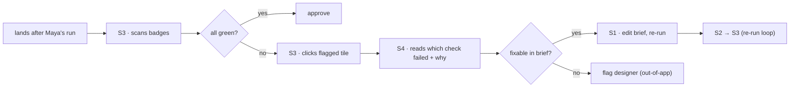
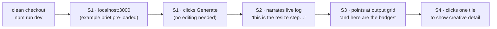
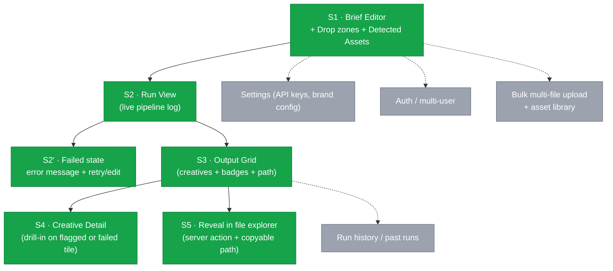
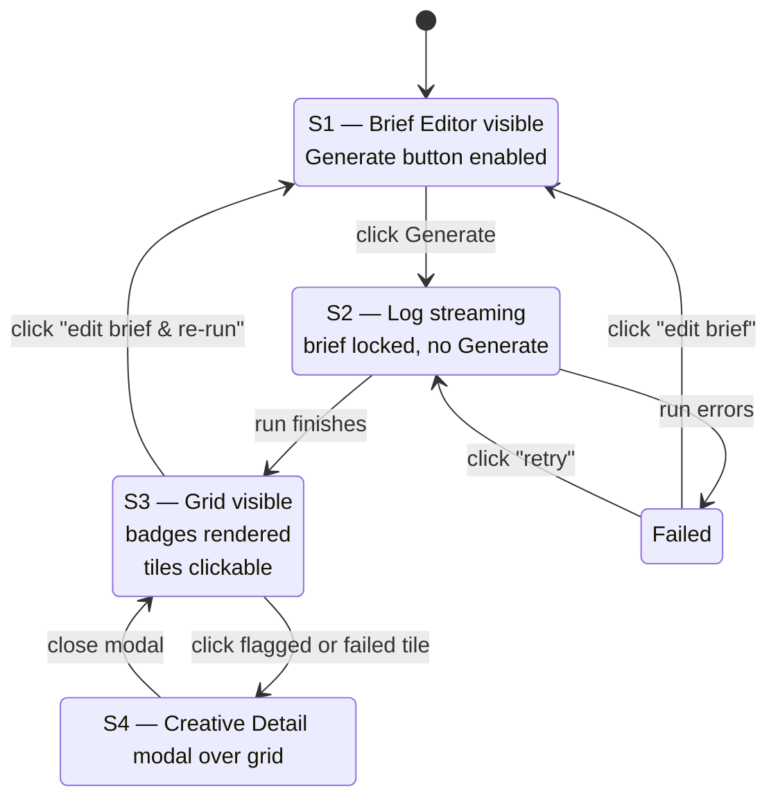

# Flow Diagrams — Cast: Creative Automation Pipeline

> Translates the [system map](system-map.md) into screens and the routes between them. Each user story from [user-stories.md](user-stories.md) is walked through the diagram to validate that Maya, Priya, and Aaron can finish their jobs without dead ends.

---

## 1. List of screens

Working from the system map, the seven subsystems collapse into **five screens** for the POC. The pipeline is a single-tool experience — there is no auth, no multi-tenancy, no history. State transitions on a single page do most of the work; only compliance-detail and the output folder are separate destinations.

| #   | Screen                                                 | Owner subsystem                                     | Why it exists (story)                                                                                                        |
| --- | ------------------------------------------------------ | --------------------------------------------------- | ---------------------------------------------------------------------------------------------------------------------------- |
| S1  | **Home / Brief Editor + Detected Assets + Drop zones** | Brief Editor + Asset Resolver (preview) + Upload    | Maya edits brief, drops photos onto product rows, sees what the resolver will pick up; Aaron loads pre-populated example     |
| S2  | **Run View** (Live Pipeline Log)                       | Run Orchestrator → Live Log                         | Maya/Aaron watch pipeline run step by step                                                                                   |
| S2′ | **Failed state** (within S2)                           | Run Orchestrator (error path)                       | Demo-safety: a thrown error gets a visible message + recovery, not a hung spinner                                            |
| S3  | **Output Grid**                                        | Output Grid + Badge UI                              | Maya reviews creatives; Priya scans badges                                                                                   |
| S4  | **Creative Detail** (modal over S3)                    | Compliance Checker → Badge UI · Reporter `errors[]` | Priya drills into a flagged creative; Maya drills into a failed creative (dual-mode: compliance violation OR pipeline error) |
| S5  | **Reveal in File Explorer** (action, not a screen)     | Server action + copyable path                       | Maya grabs the files to ship                                                                                                 |

> **Practical note:** S1, S2, and S3 are _states of a single Next.js page_ (`/`), not separate routes. S4 is a modal/drawer over S3. S5 is a _server action_ triggered from S3 that opens the OS file explorer at the campaign output folder, with the absolute path also rendered as a copyable code block for fallback. The diagrams below treat them as logical screens for clarity.

---

## 2. Ideal flow diagram — full vision

The "magical" version of the system. Solid arrows = primary path. Dashed arrows = secondary / recovery. The MVP scope (section 4) is a subset of this.

```mermaid
flowchart TB
    Start(["open localhost:3000"]) --> S1

    subgraph S1["S1 · Home / Brief Editor"]
        Brief["Pre-loaded example brief<br/>(JSON form)"]
        EditBrief["Edit brand · products · markets<br/>audience · message · ratios"]
        Drop["Drop zone per product row<br/>(POST /api/upload → saves as<br/>inputs/assets/[slug].ext)"]
        Detected["Detected Assets panel<br/>(scans inputs/assets/<br/>by product slug after upload<br/>or pre-placement)"]
        GenBtn["Generate"]
        Brief --> EditBrief --> Drop --> Detected --> GenBtn
        EditBrief -.->|debounced 300ms| Detected
    end

    GenBtn -->|POST /api/generate<br/>NDJSON stream| S2

    subgraph S2["S2 · Run View"]
        Stream["Live pipeline log<br/>(NDJSON events: step,<br/>asset_resolved, creative_ready,<br/>compliance_result)"]
        Progress["Per-product / per-ratio progress"]
        Stream --> Progress
    end

    S2 -->|event: complete<br/>(carries manifest)| S3
    S2 -->|event: error| S2Err["S2′ · Failed state<br/>error message + retry · edit brief"]
    S2Err -->|edit| S1
    S2Err -->|retry| S2

    subgraph S3["S3 · Output Grid"]
        Grid["Row per product<br/>cols: 1:1 · 9:16 · 16:9<br/>(rendered from manifest)"]
        Badges["Compliance badges<br/>OK / WARN / FAIL"]
        Grid --> Badges
        Path["Absolute output path<br/>(copyable code block)"]
        OpenFolder["Reveal in file explorer<br/>(server action)"]
        NewRun["Edit brief & re-run"]
        Grid --> Path --> OpenFolder
        Grid --> NewRun
    end

    S3 -->|click flagged or failed tile| S4
    S4 -->|close| S3

    subgraph S4["S4 · Creative Detail (dual mode)"]
        Mode{"tile.path === null?"}
        Mode -->|no — compliance mode| Which["Which check failed<br/>(logo · palette · banned word)"]
        Mode -->|yes — error mode| Stage["Failed stage<br/>(resolve · genai · resize · compose · compliance · write)"]
        Which --> Why["Why it failed<br/>+ creative preview"]
        Stage --> ErrMsg["errors[].message<br/>+ red placeholder"]
    end

    OpenFolder --> S5(["OS file explorer<br/>opens outputs/[campaign]/"])
    NewRun --> S1
```

---

## 3. User-story walkthroughs

The validation step: read each story aloud, trace the arrows, and look for dead ends or missing screens.

### Story 1 — Maya · "ship the campaign in under three minutes"

> **Asset acquisition (two paths, same folder):**
>
> - **Drop in browser** — Maya drags a photo onto a product row in S1; server saves to `inputs/assets/[slug].ext` using the slug derived from the brief product name. _(Primary path — what Story 1 means by "drops her product photos.")_
> - **Pre-placement** — photos already living at `inputs/assets/[slug].{png,jpg,jpeg,webp}` are picked up automatically. _(Used by Aaron's "ships with the repo" demo path — see Story 3.)_
>
> Both paths feed the same **Detected Assets panel**, which shows per-product `found` / `will generate` _before_ Generate fires.

```mermaid
flowchart LR
    A[opens app] --> B["S1 · edits brief<br/>(brand, products, markets, message)"]
    B --> C["S1 · drops photos onto<br/>product rows (drop zone)"]
    C --> D["S1 · Detected Assets panel<br/>shows found / will generate"]
    D --> E["S1 · clicks Generate"]
    E --> F["S2 · watches live log<br/>(asset resolved, resized, composited)"]
    F --> G["S3 · reviews output grid<br/>2 products × 3 ratios"]
    G --> H["S3 · clicks 'Reveal in file explorer'"]
    H --> I["S5 · OS opens output folder<br/>Maya grabs files"]
```



**Covered.** Every verb (open, edit, drop, confirm assets, generate, watch, review, reveal, download) lands on a screen or a defined action. No backtracking required.

### Story 2 — Priya · "see compliance at a glance"



**Covered.** Priya never has to leave the grid for routine cases; the drill-in is one click away.

### Story 3 — Aaron · "narrate the demo"



**Covered.** The pre-populated brief means S1 is a 0-second screen for Aaron — he goes straight to Generate. The live log on S2 is the demo's centerpiece.

---

## 4. MVP cut — what ships first

The smallest thing that delivers value. Green = MVP. Grey = nice-to-have / v2.



The six MVP elements cover **100% of the verbs in all three user stories** plus a recovery path for live demos. Everything in grey is a v2 conversation.

### 4.1 Asset acquisition — drop zones + Detected Assets panel

Two input paths, one folder, one resolver. Maya doesn't have to learn the slug rule; the server applies it on upload.

**Asset filename convention** (single source of truth — used by Resolver, Upload route, and Detected Assets panel):

- Product name → slug: lowercase, non-alphanumeric runs collapsed to `-`, leading/trailing `-` stripped.
  - `"Brisa Citrus"` → `brisa-citrus`
  - `"Volt Original"` → `volt-original`
- Slugs must match `SLUG_RE = /^[a-z0-9]+(?:-[a-z0-9]+)*$/` server-side. Non-conforming → 400.
- **Asset extension matrix** — the only authoritative answer to “which extensions are allowed where?”:

  | Operation                   | Accepted MIME types (filename ext ignored) | Notes                                                                                                                                                          |
  | --------------------------- | ------------------------------------------ | -------------------------------------------------------------------------------------------------------------------------------------------------------------- |
  | Upload (`POST /api/upload`) | `image/png`, `image/jpeg`, `image/webp`    | Filename extension is **not** trusted; canonical disk extension is derived from MIME (`png`→`.png`, `jpeg`→`.jpg`, `webp`→`.webp`). Anything else → 415.       |
  | Resolver lookup             | `.png`, `.jpg`, `.jpeg`, `.webp`           | First hit wins. Pre-placed `.jpeg` files are accepted on read.                                                                                                 |
  | Disk write extensions       | `.png`, `.jpg`, `.jpeg`, `.webp`           | The set of files Resolver may unlink before a re-upload (delete-then-write). `.jpeg` is included so a pre-placed file doesn't orphan after a drop-zone upload. |
  | Output creative             | `.png`                                     | Always PNG. Sharp encodes from the composited buffer.                                                                                                          |
  | Animated formats            | _none_                                     | `.gif`, `.mp4`, `.webm` are rejected at upload (415) and ignored at resolve.                                                                             |

- No file found → Asset Resolver falls back to GenAI on Generate.

**Two ways an asset gets into `inputs/assets/`:**

| Path                            | How                                                                                                      | When used                              |
| ------------------------------- | -------------------------------------------------------------------------------------------------------- | -------------------------------------- |
| **Drop zone (per product row)** | Maya drags a file onto the product row in S1 → `POST /api/upload` saves it as `inputs/assets/[slug].ext` | Story 1 — Maya's primary path          |
| **Pre-placement**               | File already exists at `inputs/assets/[slug].{png,jpg,jpeg,webp}` before app launch                      | Story 3 — Aaron's repo-shipped example |

**Component:** [`shadcn-dropzone`](https://shadcn-dropzone.vercel.app/docs) — installed via `npx shadcn@latest add 'https://shadcn-dropzone.vercel.app/dropzone.json'`. Built on the shadcn primitive set we're already using. Single-file mode per product row, `accept: image/png,image/jpeg,image/webp`, image-preview variant, retry + remove file slots wire to `/api/upload` retry semantics. `useDropzone()` hook bound per row; `onDropFile` calls upload then triggers `/api/detected-assets` re-fetch.

**Panel rendering (per product in the brief):**

| Brief product    | Resolver looks for                 | Panel shows                                   |
| ---------------- | ---------------------------------- | --------------------------------------------- |
| `"Brisa Citrus"` | `brisa-citrus.{png,jpg,jpeg,webp}` | found: `brisa-citrus.png` (using local asset) |
| `"Brisa Berry"`  | `brisa-berry.{png,jpg,…}`          | no asset found — will generate via GenAI      |

The panel re-scans whenever the brief's product list changes _or_ an upload completes. This makes the resolver's behavior _visible before commitment_, which kills a whole class of "why did it generate when I had a photo?" demo questions.

**Re-fetch trigger semantics (avoid keystroke storms):**

| Trigger                                 | Debounce                | Rationale                                                                                                                                                                                                         |
| --------------------------------------- | ----------------------- | ----------------------------------------------------------------------------------------------------------------------------------------------------------------------------------------------------------------- |
| S1 mount                                | none — fire immediately | Initial state must be correct on load                                                                                                                                                                             |
| Successful upload (`/api/upload` → 200) | none — fire immediately | Confirms the just-dropped file landed                                                                                                                                                                             |
| Brief edit (`onChange` on the form)     | **300 ms debounce**     | Maya types product names character-by-character; a per-keystroke filesystem scan is wasted work and risks inconsistent UI flicker. Trailing-edge debounce on the field's last change before the panel re-fetches. |

Implementation note: the brief-editor `onChange` handler updates local state synchronously, but the `/api/detected-assets` call is scheduled through a debounced function (e.g. `useDebouncedCallback(refetchDetectedAssets, 300)`). Mount and post-upload calls bypass the debounce.

### 4.2 API contract — streaming generate + light upload/preview

Three endpoints, two of them tiny:

```
POST /api/upload
Content-Type: multipart/form-data
Fields: productSlug=brisa-citrus, file=<binary>

Response: { "ok": true, "path": "inputs/assets/brisa-citrus.png" }

Constraints (enforced server-side, single source of truth):
  - productSlug must match SLUG_RE = /^[a-z0-9]+(?:-[a-z0-9]+)*$/ → else 400
  - Content-Length ≤ 5 MB → else 413 (rejected before disk write)
  - MIME must be one of: image/png, image/jpeg, image/webp → else 415
  - Extension is canonical-mapped: png→.png, jpeg→.jpg, webp→.webp
    (NOT derived from filename — derived from MIME)
  - On write: delete inputs/assets/[slug].{png,jpg,jpeg,webp} first, then write
    the canonical extension. One slug → one file on disk at a time.
  - Path constructed via safeJoin("inputs", "assets", `${slug}.${ext}`) — rejects
    traversal even if SLUG_RE is bypassed.

GET /api/detected-assets?slugs=brisa-citrus,brisa-berry
Response: [
  { "slug": "brisa-citrus", "foundFile": "brisa-citrus.png" },
  { "slug": "brisa-berry", "foundFile": null }
]
  — called on S1 mount (immediate), on brief edit (300ms debounced),
    and after each successful upload (immediate)
  — every slug in the query string is validated with SLUG_RE before
    any filesystem call; lookups go through safeJoin("inputs", "assets", ...).

POST /api/generate
Content-Type: application/json
Body: <brief JSON> (validated against briefSchema — single Zod schema
  shared between client editor validation and server entry)

Response: text/x-ndjson  (streamed)
  { "type": "step", "message": "run started" }
  { "type": "asset_resolved", "product": "brisa-citrus", "source": "local" }
  { "type": "creative_ready", "product": "brisa-citrus", "market": "us-en", "ratio": "1x1", "path": "outputs/..." }
  { "type": "compliance_result", "product": "brisa-citrus", "market": "us-en", "ratio": "1x1", "badge": "OK", "checks": {...} }
  ...
  { "type": "complete", "manifest": { "campaign": "...", "brand": "...", "outputDir": "/abs/path/outputs/...", "creatives": [...] } }
```

**Error-transport contract.** Validation errors that fire **before** the stream opens (briefSchema rejection, brand-profile load failures — `BrandNotFoundError` / `BrandIncompleteError` / `BrandInvalidError`, `briefSchema` `superRefine` violations including unknown `logoVariant`) return `application/json` with a `400` status and a `{ errors: [{ path, message }] }` body. Once the first NDJSON byte ships, all subsequent failures emit `{ "type": "error", "stage": ..., "message": ... }` events on the stream and the run continues per failure semantics — the response code stays `200`. Clients distinguish by HTTP status code and the `Content-Type` response header (`400 application/json` vs `200 application/x-ndjson`).

**Stream idle timeout.** The S2 client wraps the NDJSON `fetch` in an `AbortController` and resets a 90-second idle timer on every received event. If 90 s pass with no event — no `step`, no `creative_ready`, no `error`, no `complete` — the client aborts the request and synthesizes a terminal `{ type: 'error', stage: 'stream', message: 'stream idle for 90s — aborted' }` event so the state machine cleanly transitions `Running → Failed (S2′)`. Without this guard, a hung GenAI call or a server crash mid-stream would leave the UI spinning forever with no way to retry. 90 s is calibrated above the worst-case observed `dall-e-3` latency (≈45 s) but well below user-abandonment.

### Brief schema (canonical Zod definition)

The **single source of truth** for brief validation. Same schema used client-side (editor validation) and server-side (`/api/generate` entry). Every other doc references this block; field names and shapes do not get restated elsewhere.

```ts
import { z } from "zod";

const SLUG_RE = /^[a-z0-9]+(?:-[a-z0-9]+)*$/;
const MARKET_RE = /^[a-z]{2}-[a-z]{2}$/; // <region>-<lang>, e.g. us-en, mx-es
const RATIO = z.enum(["1x1", "9x16", "16x9"]);

export const briefSchema = z
  .object({
    campaign: z.string().regex(SLUG_RE),
    brand: z.string().regex(SLUG_RE),
    products: z
      .array(
        z.object({
          name: z.string().min(1),
          sku: z.string().min(1),
          promptOverrides: z
            .object({
              environment: z.string().optional(),
              mood: z.array(z.string()).optional(),
            })
            .optional(),
        }),
      )
      .min(1),
    markets: z.array(z.string().regex(MARKET_RE)).min(1),
    audience: z.string().min(1).max(500),
    message: z.record(z.string().regex(/^[a-z]{2}$/), z.string().min(1)),
    ratios: z.array(RATIO).min(1),
    // Optional logo variant id; cross-validated against the loaded brand
    // at /api/generate entry (briefSchema alone has no brand state). When
    // omitted, the orchestrator falls back to `brandProfile.defaultLogoId`.
    logoVariant: z.string().regex(SLUG_RE).optional(),
  })
  .superRefine((brief, ctx) => {
    // Every market's locale (suffix after `-`) must have a message string.
    for (const market of brief.markets) {
      const locale = market.split("-").pop()!;
      if (!(locale in brief.message)) {
        ctx.addIssue({
          code: z.ZodIssueCode.custom,
          path: ["message"],
          message: `market ${market} requires message["${locale}"]`,
        });
      }
    }
    // Derived product slugs must be unique — same slug means same
    // upload target, same resolver hit, same output folder. Catches
    // "Brisa Citrus" vs "Brisa  Citrus" (extra space) collisions before
    // they corrupt the run.
    const seen = new Map<string, number>();
    brief.products.forEach((p, i) => {
      const slug = slugify(p.name);
      if (seen.has(slug)) {
        ctx.addIssue({
          code: z.ZodIssueCode.custom,
          path: ["products", i, "name"],
          message: `product name slugs to "${slug}" which collides with products[${seen.get(slug)}].name`,
        });
      } else {
        seen.set(slug, i);
      }
    });
  });

export type Brief = z.infer<typeof briefSchema>;
```

**`slugify` is the same function used by `/api/upload` and the Asset Resolver** — lowercase, non-alphanumeric runs collapsed to `-`, leading/trailing `-` stripped. One implementation, one import path; not three independent regexes that drift.

**Market → locale mapping rule:** `locale = market.split('-').pop()`. The `superRefine` rejects any brief whose markets reference a locale missing from `message{}`. There is no separate `locales` field on the brief.

**Run artifacts written to `outputDir`** (alongside the per-product creative subfolders):

- `brief.json` — verbatim copy of the validated brief that produced this run. Written before the per-product loop. Lets a reviewer reproduce or audit a run from the output folder alone, without going back to `inputs/`.
- `report.json` — compliance + run summary. Written by the Reporter after the loop completes, before the `complete` event fires.

Both files are `safeJoin(outputDir, name)` writes; `outputDir` is itself derived from `safeJoin("outputs", campaignSlug)` with `SLUG_RE` validation.

**Canonical manifest / `report.json` shape** — the object delivered in the `complete` event is identical to `report.json`'s on-disk content (camelCase throughout):

```json
{
  "campaign": "summer-refresh-2026",
  "brand": "brisa",
  "outputDir": "/abs/path/to/cast/outputs/summer-refresh-2026",
  "counts": {
    "requested": 12,
    "succeeded": 11,
    "failed": 1,
    "generated": 6,
    "reused": 5,
    "flagged": 2
  },
  "creatives": [
    {
      "product": "brisa-citrus",
      "market": "us-en",
      "ratio": "1x1",
      "source": "local",
      "path": "outputs/summer-refresh-2026/us-en/brisa-citrus/1x1.png",
      "compliance": {
        "badge": "OK",
        "checks": { "logoPresent": true, "colorsOk": true, "bannedWords": [] }
      }
    },
    {
      "product": "brisa-berry",
      "market": "mx-es",
      "ratio": "9x16",
      "source": "genai",
      "path": null
    }
  ],
  "errors": [
    {
      "product": "brisa-berry",
      "market": "mx-es",
      "ratio": "9x16",
      "stage": "genai",
      "message": "OpenAI request timed out after 60s"
    }
  ]
}
```

- `creatives[].path` is repo-relative `string` on success, `null` on failure. The grid renders a red placeholder tile for `null` paths. Join with `manifest.outputDir` (absolute) for filesystem operations; render `path` directly for repo-relative links.
- `errors[]` is the dedicated failure log: every `null`-path creative has a corresponding entry. Top-level `counts.failed === errors.length`.
- **Counts invariant:** `counts.generated + counts.reused === counts.succeeded`. Failed creatives do **not** increment `generated` / `reused` — those buckets are success-only. `flagged` and `failed` are independent axes: `flagged` counts successful creatives whose compliance badge is `WARN` or `FAIL`. A failed creative does not increment `flagged` even when a `write`-stage failure preserves a compliance object — `flagged` is gated on success, not on compliance presence.
- `source` ∈ `'local' | 'genai'` reflects the **path attempted**, not the path that produced bytes: a `resolve`-stage failure (pre-placed file unreadable) carries `source: 'local'`; a `genai`-stage failure (OpenAI error or cap exhaustion) carries `source: 'genai'`. This keeps the failed-tile error mode in S4 informative about which input pathway broke.
- `compliance.badge` ∈ `'OK' | 'WARN' | 'FAIL'`. The `compliance` field is **omitted** on every failed creative except `write`-stage failures. Pipeline order is `resolve → genai → resize → compose → compliance → write`: failures at `resolve | genai | resize | compose` precede compliance (no result possible); a `compliance`-stage throw produced no completed result; a `write`-stage failure occurs _after_ compliance succeeded, so the completed compliance object is preserved on the manifest entry even though `path === null`. The grid still never renders a compliance badge for a failed tile — the red placeholder + stage label takes its place — but S4 (Creative Detail, error mode) reads the preserved compliance for `write`-stage failures.
- `errors[].stage` ∈ `'resolve' | 'genai' | 'resize' | 'compose' | 'compliance' | 'write'` — names the pipeline stage that threw. Closed enum; do not invent new values without updating this table:

  | stage        | When it fires                                                                                                                                                                                                                                                                                                                                                                                                                                                                    |
  | ------------ | -------------------------------------------------------------------------------------------------------------------------------------------------------------------------------------------------------------------------------------------------------------------------------------------------------------------------------------------------------------------------------------------------------------------------------------------------------------------------------- |
  | `resolve`    | Asset Resolver couldn't read a pre-placed file (corrupt, EACCES, unreadable).                                                                                                                                                                                                                                                                                                                                                                                                    |
  | `genai`      | OpenAI Images API call failed, or a retryable transport error (e.g. `ETIMEDOUT` / `ECONNRESET`) exhausted retries. Transient `429`/`5xx` and transport failures retry up to 3 attempts with exponential backoff before this entry is written. `errors[].message` format: HTTP failures → `<status> <provider error string>` verbatim; non-HTTP transport failures → `OpenAI <code>: <message>` (e.g. `OpenAI ETIMEDOUT: ...`). |
  | `resize`     | Sharp threw decoding or resizing the source image.                                                                                                                                                                                                                                                                                                                                                                                                                               |
  | `compose`    | Text overlay / logo composite failed (font load, alpha-channel issue).                                                                                                                                                                                                                                                                                                                                                                                                           |
  | `compliance` | Compliance checker threw (palette sample, banned-words read, logo template).                                                                                                                                                                                                                                                                                                                                                                                                     |
  | `write`      | Output PNG write failed (ENOSPC, EACCES, path collision).                                                                                                                                                                                                                                                                                                                                                                                                                        |

**Parallel generation** — for each product, all requested ratios fan out via `Promise.all`. Markets iterate sequentially in the outer loop (deterministic log order); ratios run in parallel within each `(product, market)` pair. The sequence diagram caption in §4 reflects this.

- **S1 drop zone** → `POST /api/upload` then re-fetch `/api/detected-assets` (immediate).
- **S1 brief edit** → debounce 300 ms → re-fetch `/api/detected-assets`.
- **S2** consumes the generate stream and renders log lines as they arrive.
- **S3** hydrates from the **`complete` event's `manifest`** — no second `GET` to the filesystem, no race with disk writes.
- **S2′ (Failed)** is triggered by an `{ "type": "error", "message": "..." }` event or a stream-level failure.
- **S5 (Reveal)** uses `manifest.outputDir` for the server-action shell-out and as the copyable absolute path.

---

## 4.3 Implementation primitives

The contract layer above is what the user sees. These are the server-side primitives the implementer must wire.

### Per-brand profile

Cast serves arbitrary clients; brand identity is a per-campaign input, not a constant. The brief's required `brand` slug points to a directory:

```
inputs/brands/[brand-slug]/
├── brand.json          # primary/accent colors (hex), tokens
├── voice.json          # tone, do/don't lists, prompt fragments
├── logos/              # corner-composited logo variants (PNG with alpha)
│   ├── primary-on-light.png
│   ├── primary-on-dark.png
│   ├── mono-white.png
│   └── mono-black.png
├── logos.json          # { default: variantId, variants: [{ id, displayName, file }] }
├── font.ttf            # OFL-licensed display font for text overlay
└── banned-words.json?  # additive layer — merged with library defaults at load time
```

The repo ships two demo profiles (`inputs/brands/brisa/` and `inputs/brands/volt/`), modeling the sub-brands of a fictional Onda Beverages portfolio. Onboarding a new brand is a directory drop — no code change. The Asset Resolver, prompt builder, and compliance checker all read from this directory based on `brief.brand`. The reduction from each brand's HTML guidelines under [docs/design/](design/) into the JSON files above is documented in [brand-extraction.md](brand-extraction.md).

**One brand per brief.** A brief targets exactly one brand; portfolio runs are sequential briefs (Brisa run → Volt run → ...). Mixing brands in one brief breaks the brand-voice promise: each sub-brand has its own palette, banned-words list, and tone. Multi-brand briefs are listed in [§8 Future scope](#8-future-scope-v2--explicitly-out-of-poc).

**Brand discovery in S1.** S1's brand selector lists every directory found under `inputs/brands/`, served by **`GET /api/brands`** (list) and **`GET /api/brands/[slug]`** (detail):

```
GET /api/brands
Response: [
  { "slug": "brisa", "displayName": "Brisa" },
  { "slug": "volt",  "displayName": "Volt"  }
]

GET /api/brands/[slug]
Response: {
  "slug": "brisa",
  "displayName": "Brisa",
  "bannedWords": [
    /* union: lib defaults from `lib/banned-words.ts` (`getDefaultBannedWords()`)
       + brand-specific terms from `inputs/brands/[brand]/banned-words.json`,
       deduped, lowercased. Defaults always apply — even when the brand file is absent. */
  ],
  "logos": {
    "default": "primary-on-light",
    "variants": [
      { "id": "primary-on-light", "displayName": "Primary · on light", "url": "/api/brands/brisa/logos/primary-on-light" },
      { "id": "primary-on-dark",  "displayName": "Primary · on dark",  "url": "/api/brands/brisa/logos/primary-on-dark"  },
      { "id": "mono-white",       "displayName": "Mono · white",       "url": "/api/brands/brisa/logos/mono-white"       },
      { "id": "mono-black",       "displayName": "Mono · black",       "url": "/api/brands/brisa/logos/mono-black"       }
    ]
  }
}

GET /api/brands/[slug]/logos/[id]
Response: image/png  (the variant file, served through safeJoin against ROOTS.inputs;
                     `inputs/` is NOT exposed as a static tree — every byte ships through this proxy)
```

The **list** handler enumerates `inputs/brands/*/`, validates each subdirectory's slug against `SLUG_RE`, and reads `displayName` from `brand.json`. The **detail** handler additionally returns the union banned-words list (lib defaults + brand file) and the parsed `logos.json` with proxied variant URLs. Adding a profile makes it available in the UI on next page load — no rebuild.

**Brand existence + integrity check (server-side at `/api/generate` entry).** `briefSchema` validates the slug shape, not its presence on disk. Before the run starts, the orchestrator calls `loadBrandProfile(brief.brand)` which:

- Verifies `inputs/brands/[brand]/` exists → else throws `BrandNotFoundError` → mapped to `400 { errors: [{ path: ['brand'], message: 'unknown brand: ...' }] }`.
- Verifies required files exist (`brand.json`, `voice.json`, `logos.json`, at least one PNG referenced by `logos.json` `variants[].file` under `logos/`, `font.ttf`) → else throws `BrandIncompleteError` → mapped to `400 { errors: [{ path: ['brand', '<missing-file>'], message: '...' }] }`.
- Validates each file against the matching sub-schema of `brandProfileSchema` (see [Brand profile schema](#brand-profile-schema-contract)) — `brand.json` against `brandJsonSchema`, `voice.json` against `voiceJsonSchema`, `banned-words.json` (when present) against `bannedWordsSchema`, `logos.json` against `logosManifestSchema`. `font.ttf` is existence-checked only (no parse). Any failure throws `BrandInvalidError` → mapped to `400` with the Zod issue path.
- On success, returns the parsed `BrandProfile` and caches it in-process for 90 s (cheap reads on repeat runs in the same `next dev` session). **The cache is keyed on slug with a fixed 90 s TTL; there is no mtime invalidation.** Edits to `inputs/brands/[brand]/*` mid-session may not take effect until the cache expires — accepted POC behavior, documented in the README assumptions. Restart `next dev` to force-refresh.

This is the security boundary for the brand axis: every field that becomes a path segment is regex-validated by the schema **and** existence-validated by the loader before anything touches the filesystem.

### Brand profile schema (contract)

The brand directory is a typed contract, not a free-form folder. `loadBrandProfile(brand)` Zod-validates each file on first read and caches the parsed result for 90 s.

```ts
import { z } from "zod";

const HEX = /^#[0-9a-fA-F]{6}$/;

export const brandColorsSchema = z.object({
  primary: z.string().regex(HEX),
  accent: z.string().regex(HEX),
  background: z.string().regex(HEX).optional(),
  text: z.string().regex(HEX).optional(),
});

export const brandJsonSchema = z.object({
  displayName: z.string().min(1),
  colors: brandColorsSchema,
  tokens: z.record(z.string(), z.string()).optional(),
});

export const voiceJsonSchema = z.object({
  tone: z.string().min(1),
  do: z.array(z.string()).default([]),
  dont: z.array(z.string()).default([]),
  promptFragments: z.array(z.string()).default([]),
});

export const bannedWordsSchema = z.array(z.string().min(1));

export const logoVariantSchema = z.object({
  id: z.string().regex(SLUG_RE),
  displayName: z.string().min(1),
  file: z.string().regex(/^[a-z0-9-]+\.png$/), // safeJoin-resolved against logos/
});

export const logosManifestSchema = z
  .object({
    default: z.string().regex(SLUG_RE),
    variants: z.array(logoVariantSchema).min(1),
  })
  .superRefine((m, ctx) => {
    const ids = new Set(m.variants.map((v) => v.id));
    if (!ids.has(m.default)) {
      ctx.addIssue({
        code: z.ZodIssueCode.custom,
        path: ["default"],
        message: `default "${m.default}" not found in variants[]`,
      });
    }
    const seen = new Set<string>();
    m.variants.forEach((v, i) => {
      if (seen.has(v.id)) {
        ctx.addIssue({
          code: z.ZodIssueCode.custom,
          path: ["variants", i, "id"],
          message: `duplicate variant id "${v.id}"`,
        });
      }
      seen.add(v.id);
    });
  });

// Aggregator — the external contract `loadBrandProfile` validates against.
// system-map §3 references this symbol by name; the per-file schemas
// above are its building blocks.
export const brandProfileSchema = z.object({
  brand: brandJsonSchema,
  voice: voiceJsonSchema,
  bannedWords: bannedWordsSchema.default([]),
  logos: logosManifestSchema,
});

export type BrandProfile = {
  slug: string;
  brand: z.infer<typeof brandJsonSchema>;
  voice: z.infer<typeof voiceJsonSchema>;
  bannedWords: string[]; // union: lib defaults + brand file (deduped, lowercased)
  logoVariants: { id: string; displayName: string; path: string }[]; // each path safeJoin-validated
  defaultLogoId: string;
  fontPath: string; // absolute, safeJoin-validated
};
```

**Banned-words composition.** `loadBrandProfile` always returns the **union** of (a) `getDefaultBannedWords()` from `lib/banned-words.ts` — the universal floor covering violence, hate, NSFW, weapons, drugs, self-harm — and (b) the brand-specific terms in `inputs/brands/[brand]/banned-words.json` (when present). The list is deduped and lowercased. Both pre-flight (S1, via `GET /api/brands/[slug]`) and per-creative server-side checks operate on this union; defaults always apply.

**Missing `banned-words.json`** is allowed and means "no brand-specific additions" — **not** "checks disabled." The loader emits a `step` event — `{ \"type\": \"step\", \"message\": \"no brand-specific banned-words for X — running default list only\" }` — and the run proceeds with only the lib defaults. Optional means optional on the brand layer, not on the floor.

### GenAI provider

OpenAI Images API. Model: `dall-e-3` for the default path; `gpt-image-1` when `CAST_GENAI_MODE=cheap`.

| Mode    | Model         | Calls per missing product | Sizes                                                              |
| ------- | ------------- | ------------------------- | ------------------------------------------------------------------ |
| Default | `dall-e-3`    | One per requested ratio   | `1024x1024` (1x1), `1792x1024` (16x9), `1024x1792` (9x16) — native |
| `cheap` | `gpt-image-1` | One per missing product   | `1024x1024` only; Sharp center-crops to 9x16 / 16x9                |

Mode is selected by env var **`CAST_GENAI_MODE`** (`default` | `cheap`, default `default`); the same value is exposed to the client via `NEXT_PUBLIC_CAST_GENAI_MODE` so S1 renders a read-only mode badge without a runtime API call. There is no CLI flag — this is a Next.js app, not a CLI. A missing product with all three ratios requested costs three API calls in default mode (no upscale loss, no center-crop). The `cheap` path costs one call, trading edge fidelity for spend.

### Prompt construction

Three-layer assembly, deterministic, no LLM-on-LLM:

1. Brand layer — read `inputs/brands/[brand]/voice.json` for tone, mood, banned imagery.
2. Product layer — merge per-product `promptOverrides` from the brief (environment, mood adjectives).
3. Template fn — a pure function `buildPrompt({ brandVoice, product, market, ratio })` returns the final string.

S1 renders the assembled prompt read-only beneath each missing product so the user sees what will hit the API before clicking Generate.

### Storage abstraction

One interface, one POC implementation:

```ts
interface Storage {
  read(key: string): Promise<Buffer>;
  write(key: string, data: Buffer): Promise<void>;
  list(prefix: string): Promise<string[]>;
  exists(key: string): Promise<boolean>;
}
```

POC ships `LocalFsStorage` resolving keys against `ROOTS = { inputs, outputs }` via `safeJoin`. S3 / Azure / Dropbox are single-class swaps documented as v2.

### Path safety primitives

- `ROOTS = { inputs: path.resolve(cwd, 'inputs'), outputs: path.resolve(cwd, 'outputs') }`.
- `safeJoin(rootKey, ...segments)` resolves the absolute path then asserts `result.startsWith(ROOTS[rootKey] + path.sep)`. Mismatch → throw.
- Every `[campaign]`, `[brand]`, `[product-slug]`, `[market]` token is validated against its regex (`SLUG_RE` or `MARKET_RE`) **before** entering `safeJoin`.
- Shell calls (`revealOutputFolder`) use `execFile` with explicit argv — never `exec` with a composed string.
- **Symlinks are not followed safely** — `safeJoin` is lexical only; it does not call `realpath` to re-validate after symlink resolution. Accepted POC limitation (single-machine, no untrusted users). Implementers touching a route that interpolates user-influenced paths (`/api/upload`, `/api/detected-assets`, `revealOutputFolder`, Sharp reads) MUST add a `// TODO(symlink-hardening)` comment alongside each `safeJoin` call so the gap stays visible for the production-hardening pass (which would add `fs.realpath` re-validation after the lexical check).

### Compliance + banned-words

Banned words are checked twice, both passes operating on the same union list (lib defaults + brand file) returned by `loadBrandProfile`:

- **Client-side, pre-flight** — the editor in S1 fetches the brand's union list via `GET /api/brands/[slug]` on selection and cross-references the brief's message strings using `containsBannedWord(text, list)` from `lib/banned-words.ts`. Hits disable the Generate button with an inline warning.
- **Server-side, post locale-resolution** — for each `(market, ratio)` the compliance checker re-checks the **resolved overlay string** (the exact string the compositor will draw, after locale lookup) against the same union list. Hits flag the creative with `WARN` (or `FAIL` for high-severity terms) and append to `report.json`'s `errors[]`.

This is a string check, not OCR — the server composited the text itself, so OCR'ing the rendered PNG would be redundant and unreliable on stylized fonts. Catches both authoring mistakes (early) and locale-map errors that slip past pre-flight (late).

**Single-source rule.** Both passes import the same `containsBannedWord(text, list)` symbol from `lib/banned-words.ts`. Route handlers (`/api/brands/[slug]`, `/api/generate`) and the S1 client must not re-implement substring matching, normalization, or the union composition — they call the shared symbol against the union list returned by `loadBrandProfile`. Drift between client pre-flight and server compliance produces the worst possible UX: “S1 said clean, the badge says flagged” (or vice versa). A parity test enforces the import path.

---

## 5. Screen-state map — what changes within a screen

Because S1/S2/S3 are states of one page, here is the state machine for the main route `/`. Useful for the next step (wireframes) so we know what each state needs to render.



---

## 6. Coverage check — every story verb has a screen

Final sanity pass. If any verb lacks a screen, the flow diagram is broken.

| Story verb                          | Screen                                          | State                               |
| ----------------------------------- | ----------------------------------------------- | ----------------------------------- |
| open app                            | S1                                              | Editing                             |
| edit brief                          | S1                                              | Editing                             |
| selects brand                       | S1 (Brand selector → `/api/brands`)             | Editing                             |
| **drop product photos onto rows**   | S1 (drop zone → `/api/upload`)                  | Editing                             |
| pre-place files in `inputs/assets/` | (filesystem path — Aaron's demo)                | confirmed via Detected Assets panel |
| confirm assets will be picked up    | S1 (Detected Assets panel)                      | Editing                             |
| sees GenAI mode                     | S1 (mode badge ← `NEXT_PUBLIC_CAST_GENAI_MODE`) | Editing                             |
| click Generate                      | S1                                              | Editing → Running                   |
| watch pipeline log                  | S2                                              | Running                             |
| recover from a run failure          | S2′                                             | Failed                              |
| review output grid                  | S3                                              | Complete                            |
| read compliance badge               | S3                                              | Complete                            |
| click flagged tile                  | S3 → S4                                         | Complete → DetailOpen               |
| click failed tile (`path === null`) | S3 → S4                                         | Complete → DetailOpen (error mode)  |
| read compliance detail              | S4                                              | DetailOpen                          |
| reveal output folder                | S3 → S5                                         | Complete (server action)            |
| copy absolute output path           | S3                                              | Complete                            |
| download files                      | OS file explorer                                | (post-handoff)                      |
| narrate demo                        | S2 + S3                                         | Running, Complete                   |

Every verb maps to a screen, a state, or a defined action. No orphans.

---

## 7. What this unlocks

With screens + flow + states + API contract locked, the next step (wireframes) has a clean spec:

- **One Next.js route** (`/`) handling four states: `Editing`, `Running`, `Complete`, `Failed`.
- **One modal/drawer** for `DetailOpen` (S4).
- **One server action** for S5 — `revealOutputFolder(absPath)` reveals the generated output folder via the OS (`explorer.exe` on Windows / `open` on macOS / `xdg-open` on Linux). `absPath` must be normalized and validated to remain within the expected outputs directory before invocation. Do **not** build the command via string interpolation or shell concatenation of untrusted input; use a `spawn`/`execFile`-style API with explicit args. Fallback: copyable absolute path on screen.
- **Per-product drop zone** on S1 → `POST /api/upload` (multipart, `productSlug` + `file`) writes to `inputs/assets/[slug].ext`.
- **Asset preview read** — `GET /api/detected-assets?slugs=...` on S1 mount (immediate), on brief change (300 ms debounced), and after each upload (immediate). Returns `[{ slug, foundFile | null }]` for the Detected Assets panel.
- **Streaming generate** — `POST /api/generate` returns NDJSON; terminal `complete` event carries the full manifest. S2 reads the stream; S3 hydrates from the manifest. **No separate output-read endpoint.**
- **One filename convention** — `[product-slug].{png,jpg,jpeg,webp}` — enforced server-side by `/api/upload` and matched by Resolver and Detected Assets panel. Maya never has to type a slug.

Everything else is wireframe craft.

---

## 8. Future scope (v2+) — explicitly out of POC

Captured here so the POC's omissions are deliberate, not accidental:

- **YAML brief import** — parser swap behind the same Zod schema; ~30-line change.
- **Cloud storage backends** — S3 / Azure / Dropbox, swapped behind the `Storage` interface.
- **Outpainting / aspect extension** — `gpt-image-1` `images.edit` for true ratio extension instead of native-ratio rendering.
- **Edge transforms** — ImageKit-style URL-driven crops/transforms for downstream platform variants.
- **Brief Interpreter** — natural-language brief → structured Zod brief (LLM-assisted, validated).
- **Brand-voice editor** — Studio-like UI for `inputs/brands/[brand]/voice.json`.
- **Brand onboarding UI** — front-end flow to create a new brand profile without touching the filesystem. Replaces the hand-curated process documented in [brand-extraction.md](brand-extraction.md). Form fields map 1:1 to the runtime contract: displayName + colors (primary, accent, optional background/text) → `brand.json`; tone + do/dont lists + promptFragments[] → `voice.json`; banned-words textarea (one term per line, deduped server-side) → `banned-words.json`; logo uploads (4 variants, drag-drop, MIME + dimension validated) → `logos/*.png` + generated `logos.json`; optional font upload (TTF/OTF, OFL license attestation checkbox) → `font.ttf`. Persists via a `POST /api/brands` endpoint that writes the full directory atomically (temp dir → rename) and revalidates `/api/brands` cache. Out of POC because it requires multi-part upload handling, write-side authorization (no auth in current scope), an edit/delete surface, and validation parity with `brandProfileSchema` on the client. Composes with **Brand-voice editor** above (which becomes the edit mode of this same UI).
- **Multi-run history** — persist past runs, side-by-side comparison, approvals.
- **Comments + approval workflow** — Priya marks creatives approved/rejected with comments persisted to manifest.
- **Translation API** — auto-fill `message{}` for missing locales.
- **Multi-logo per brand** — The current **manual** campaign-level picker (one variant chosen for the whole run via `brief.logoVariant`). Per-ratio and per-market variant selection remains v2.
- **Automatic logo variant selection** — v2 follow-on. Sample luminance of the corner region where the logo will composite (post-resize, pre-overlay) and pick `mono-white` over dark areas / `mono-black` over light. Mid-tone fallback rule (e.g. luminance ∈ [0.4, 0.6]) defers to the brand's `defaultLogoId` or surfaces a `WARN` badge with reason `'logo-contrast-ambiguous'`. Out of POC: requires per-creative luminance pass before composite, plus a tested threshold table per brand.
- **Per-market brand variations** — region-specific palette/voice overrides under `inputs/brands/[brand]/markets/[market]/`.
- **Multi-brand campaign briefs** — single brief targeting multiple sub-brands in one run (e.g. an Onda portfolio launch covering both Brisa and Volt). Requires a `brands[]` field, per-product brand tagging, an extra `[brand]` segment in the output tree, and per-product compliance switching. Out of POC because it changes the campaign contract and dilutes the brand-voice promise; portfolio runs today are sequential single-brand briefs.
- **Parent brand inheritance (Onda → Brisa, Volt)** — explicitly out of POC. The Onda Beverages framing is narrative-only: it gives Brisa and Volt a believable shared universe (one corporate parent, two sub-brands with contrasting voices) so the demo's multi-brand story is concrete instead of abstract. The HTML brand guidelines under [docs/design/](design/) reference Onda for that context — they are designer-facing artifacts, not a runtime contract. Cast does NOT model parent-brand inheritance at runtime: there is no `inputs/brands/onda/` profile loaded by `loadBrandProfile`, no token cascade from parent → child, no shared banned-words/voice resolution chain. Each sub-brand's `inputs/brands/[brand]/` directory is fully self-contained. Modeling true inheritance (parent profile + child overrides with merge precedence rules) composes with **Multi-brand campaign briefs** above and **Per-market brand variations** below; all three are v2.
- **Motion creatives** — animated outputs (5-second loops, `.gif` and `.mp4` parallel to `.png` per ratio). Pipeline fan-out becomes `(product × market × ratio × format)`. Resolver, compositor, and storage each gain a format axis. Compliance gains motion-specific checks (frame-1 logo presence, looping integrity).


