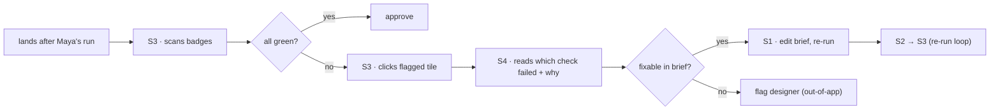
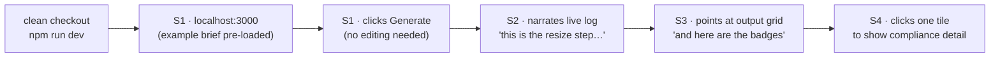
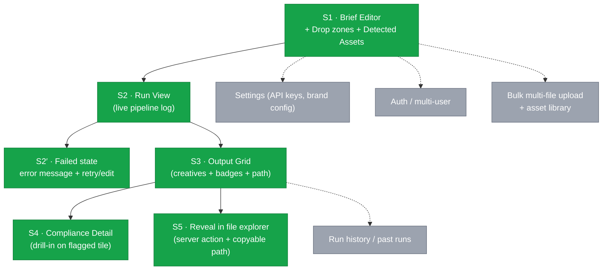
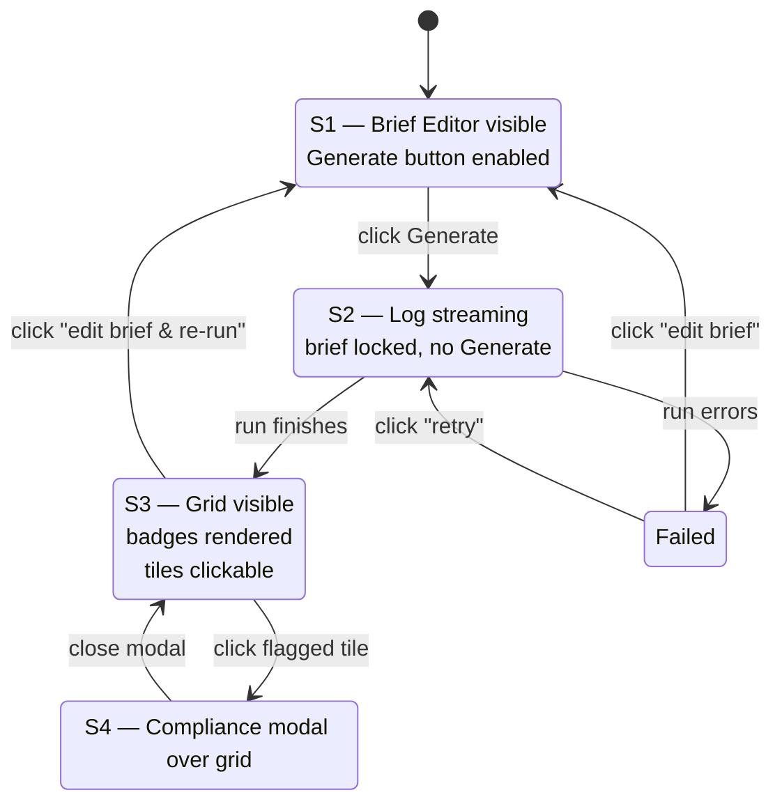

# Flow Diagrams — Cast: Creative Automation Pipeline

### Local Next.js App · POC · v1

> Translates the [system map](system-map.md) into screens and the routes between them. Each user story from [user-stories.md](user-stories.md) is walked through the diagram to validate that Maya, Priya, and Aaron can finish their jobs without dead ends.

---

## 1. List of screens

Working from the system map, the seven subsystems collapse into **five screens** for the POC. The pipeline is a single-tool experience — there is no auth, no multi-tenancy, no history. State transitions on a single page do most of the work; only compliance-detail and the output folder are separate destinations.

| #   | Screen                                                 | Owner subsystem                                  | Why it exists (story)                                                                                                    |
| --- | ------------------------------------------------------ | ------------------------------------------------ | ------------------------------------------------------------------------------------------------------------------------ |
| S1  | **Home / Brief Editor + Detected Assets + Drop zones** | Brief Editor + Asset Resolver (preview) + Upload | Maya edits brief, drops photos onto product rows, sees what the resolver will pick up; Aaron loads pre-populated example |
| S2  | **Run View** (Live Pipeline Log)                       | Run Orchestrator → Live Log                      | Maya/Aaron watch pipeline run step by step                                                                               |
| S2′ | **Failed state** (within S2)                           | Run Orchestrator (error path)                    | Demo-safety: a thrown error gets a visible message + recovery, not a hung spinner                                        |
| S3  | **Output Grid**                                        | Output Grid + Badge UI                           | Maya reviews creatives; Priya scans badges                                                                               |
| S4  | **Compliance Detail** (modal over S3)                  | Compliance Checker → Badge UI                    | Priya drills into a flagged creative                                                                                     |
| S5  | **Reveal in File Explorer** (action, not a screen)     | Server action + copyable path                    | Maya grabs the files to ship                                                                                             |

> **Practical note:** S1, S2, and S3 are _states of a single Next.js page_ (`/`), not separate routes. S4 is a modal/drawer over S3. S5 is a _server action_ triggered from S3 that opens the OS file explorer at the campaign output folder, with the absolute path also rendered as a copyable code block for fallback. The diagrams below treat them as logical screens for clarity.

---

## 2. Ideal flow diagram — full vision

The "magical" version of the system. Solid arrows = primary path. Dashed arrows = secondary / recovery. The MVP scope (section 4) is a subset of this.

```mermaid
flowchart TB
    Start(["open localhost:3000"]) --> S1

    subgraph S1["S1 · Home / Brief Editor"]
        Brief["Pre-loaded example brief<br/>(JSON form)"]
        EditBrief["Edit brand · products · markets<br/>audience · message · ratios"]
        Drop["Drop zone per product row<br/>(POST /api/upload → saves as<br/>inputs/assets/[slug].ext)"]
        Detected["Detected Assets panel<br/>(scans inputs/assets/<br/>by product slug after upload<br/>or pre-placement)"]
        GenBtn["Generate"]
        Brief --> EditBrief --> Drop --> Detected --> GenBtn
        EditBrief -.->|debounced 300ms| Detected
    end

    GenBtn -->|POST /api/generate<br/>NDJSON stream| S2

    subgraph S2["S2 · Run View"]
        Stream["Live pipeline log<br/>(NDJSON events: step,<br/>asset_resolved, creative_ready,<br/>compliance_result)"]
        Progress["Per-product / per-ratio progress"]
        Stream --> Progress
    end

    S2 -->|event: complete<br/>(carries manifest)| S3
    S2 -->|event: error| S2Err["S2′ · Failed state<br/>error message + retry · edit brief"]
    S2Err -->|edit| S1
    S2Err -->|retry| S2

    subgraph S3["S3 · Output Grid"]
        Grid["Row per product<br/>cols: 1:1 · 9:16 · 16:9<br/>(rendered from manifest)"]
        Badges["Compliance badges<br/>OK / WARN / FAIL"]
        Grid --> Badges
        Path["Absolute output path<br/>(copyable code block)"]
        OpenFolder["Reveal in file explorer<br/>(server action)"]
        NewRun["Edit brief & re-run"]
        Grid --> Path --> OpenFolder
        Grid --> NewRun
    end

    S3 -->|click flagged tile| S4
    S4 -->|close| S3

    subgraph S4["S4 · Compliance Detail"]
        Which["Which check failed<br/>(logo · palette · banned word)"]
        Why["Why it failed<br/>+ creative preview"]
        Which --> Why
    end

    OpenFolder --> S5(["OS file explorer<br/>opens outputs/[campaign]/"])
    NewRun --> S1
```

---

## 3. User-story walkthroughs

The validation step Carl and Dane both stress: read each story aloud, trace the arrows, and look for dead ends or missing screens.

### Story 1 — Maya · "ship the campaign in under three minutes"

> **Asset acquisition (two paths, same folder):**
>
> - **Drop in browser** — Maya drags a photo onto a product row in S1; server saves to `inputs/assets/[slug].ext` using the slug derived from the brief product name. _(Primary path — what Story 1 means by "drops her product photos.")_
> - **Pre-placement** — photos already living at `inputs/assets/[slug].{png,jpg,jpeg,webp}` are picked up automatically. _(Used by Aaron's "ships with the repo" demo path — see Story 3.)_
>
> Both paths feed the same **Detected Assets panel**, which shows per-product `found` / `will generate` _before_ Generate fires.

```mermaid
flowchart LR
    A[opens app] --> B["S1 · edits brief<br/>(brand, products, markets, message)"]
    B --> C["S1 · drops photos onto<br/>product rows (drop zone)"]
    C --> D["S1 · Detected Assets panel<br/>shows found / will generate"]
    D --> E["S1 · clicks Generate"]
    E --> F["S2 · watches live log<br/>(asset resolved, resized, composited)"]
    F --> G["S3 · reviews output grid<br/>2 products × 3 ratios"]
    G --> H["S3 · clicks 'Reveal in file explorer'"]
    H --> I["S5 · OS opens output folder<br/>Maya grabs files"]
```



**Covered.** Every verb (open, edit, drop, confirm assets, generate, watch, review, reveal, download) lands on a screen or a defined action. No backtracking required.

### Story 2 — Priya · "see compliance at a glance"



**Covered.** Priya never has to leave the grid for routine cases; the drill-in is one click away.

### Story 3 — Aaron · "narrate the demo"



**Covered.** The pre-populated brief means S1 is a 0-second screen for Aaron — he goes straight to Generate. The live log on S2 is the demo's centerpiece.

---

## 4. MVP cut — what ships first

Per Dane's "what's the smallest thing that delivers value" lens. Green = MVP. Grey = nice-to-have / v2.



The six MVP elements cover **100% of the verbs in all three user stories** plus a recovery path for live demos. Everything in grey is a v2 conversation.

### 4.1 Asset acquisition — drop zones + Detected Assets panel

Two input paths, one folder, one resolver. Maya doesn't have to learn the slug rule; the server applies it on upload.

**Asset filename convention** (single source of truth — used by Resolver, Upload route, and Detected Assets panel):

- Product name → slug: lowercase, non-alphanumeric runs collapsed to `-`, leading/trailing `-` stripped.
  - `"Sparkling Citrus"` → `sparkling-citrus`
  - `"Energy Drink Pro"` → `energy-drink-pro`
- Slugs must match `SLUG_RE = /^[a-z0-9]+(?:-[a-z0-9]+)*$/` server-side. Non-conforming → 400.
- **Asset extension matrix** — the only authoritative answer to “which extensions are allowed where?”:

  | Operation                   | Accepted extensions                                | Notes                                                                                |
  | --------------------------- | -------------------------------------------------- | ------------------------------------------------------------------------------------ |
  | Upload (`POST /api/upload`) | `.png`, `.jpg`, `.jpeg`, `.webp`                   | `.jpeg` is canonicalized to `.jpg` on disk. Anything else → 415.                     |
  | Resolver lookup             | `.png`, `.jpg`, `.jpeg`, `.webp`                   | First hit wins. Pre-placed `.jpeg` files are accepted on read.                        |
  | Disk write extensions       | `.png`, `.jpg`, `.webp`                            | The set of files Resolver may unlink before a re-upload (delete-then-write).          |
  | Output creative             | `.png`                                             | Always PNG. Sharp encodes from the composited buffer.                                  |
  | Animated formats            | _none_                                             | `.gif`, `.mp4`, `.webm` are rejected at upload (415) and ignored at resolve (D26).    |

- No file found → Asset Resolver falls back to GenAI on Generate.

**Two ways an asset gets into `inputs/assets/`:**

| Path                            | How                                                                                                       | When used                              |
| ------------------------------- | --------------------------------------------------------------------------------------------------------- | -------------------------------------- |
| **Drop zone (per product row)** | Maya drags a file onto the product row in S1 → `POST /api/upload` saves it as `inputs/assets/[slug].ext`  | Story 1 — Maya's primary path          |
| **Pre-placement**               | File already exists at `inputs/assets/[slug].{png,jpg,jpeg,webp}` before app launch                       | Story 3 — Aaron's repo-shipped example |

**Component:** [`shadcn-dropzone`](https://shadcn-dropzone.vercel.app/docs) — installed via `npx shadcn@latest add 'https://shadcn-dropzone.vercel.app/dropzone.json'`. Built on the shadcn primitive set we're already using. Single-file mode per product row, `accept: image/png,image/jpeg,image/webp`, image-preview variant, retry + remove file slots wire to `/api/upload` retry semantics. `useDropzone()` hook bound per row; `onDropFile` calls upload then triggers `/api/detected-assets` re-fetch.

**Panel rendering (per product in the brief):**

| Brief product        | Resolver looks for                     | Panel shows                                       |
| -------------------- | -------------------------------------- | ------------------------------------------------- |
| `"Sparkling Citrus"` | `sparkling-citrus.{png,jpg,jpeg,webp}` | found: `sparkling-citrus.png` (using local asset) |
| `"Energy Drink Pro"` | `energy-drink-pro.{png,jpg,…}`         | no asset found — will generate via GenAI          |

The panel re-scans whenever the brief's product list changes _or_ an upload completes. This makes the resolver's behavior _visible before commitment_, which kills a whole class of "why did it generate when I had a photo?" demo questions.

**Re-fetch trigger semantics (avoid keystroke storms):**

| Trigger                                 | Debounce                | Rationale                                                                                                                                                                                                         |
| --------------------------------------- | ----------------------- | ----------------------------------------------------------------------------------------------------------------------------------------------------------------------------------------------------------------- |
| S1 mount                                | none — fire immediately | Initial state must be correct on load                                                                                                                                                                             |
| Successful upload (`/api/upload` → 200) | none — fire immediately | Confirms the just-dropped file landed                                                                                                                                                                             |
| Brief edit (`onChange` on the form)     | **300 ms debounce**     | Maya types product names character-by-character; a per-keystroke filesystem scan is wasted work and risks inconsistent UI flicker. Trailing-edge debounce on the field's last change before the panel re-fetches. |

Implementation note: the brief-editor `onChange` handler updates local state synchronously, but the `/api/detected-assets` call is scheduled through a debounced function (e.g. `useDebouncedCallback(refetchDetectedAssets, 300)`). Mount and post-upload calls bypass the debounce.

### 4.2 API contract — streaming generate + light upload/preview

Three endpoints, two of them tiny:

```
POST /api/upload
Content-Type: multipart/form-data
Fields: productSlug=sparkling-citrus, file=<binary>

Response: { "ok": true, "path": "inputs/assets/sparkling-citrus.png" }

Constraints (enforced server-side, single source of truth):
  - productSlug must match SLUG_RE = /^[a-z0-9]+(?:-[a-z0-9]+)*$/ → else 400
  - Content-Length ≤ 5 MB → else 413 (rejected before disk write)
  - MIME must be one of: image/png, image/jpeg, image/webp → else 415
  - Extension is canonical-mapped: png→.png, jpeg→.jpg, webp→.webp
    (NOT derived from filename — derived from MIME)
  - On write: delete inputs/assets/[slug].{png,jpg,webp} first, then write
    the canonical extension. One slug → one file on disk at a time.
  - Path constructed via safeJoin("inputs", `${slug}.${ext}`) — rejects
    traversal even if SLUG_RE is bypassed.

GET /api/detected-assets?slugs=sparkling-citrus,energy-drink-pro
Response: [
  { "slug": "sparkling-citrus", "foundFile": "sparkling-citrus.png" },
  { "slug": "energy-drink-pro", "foundFile": null }
]
  — called on S1 mount (immediate), on brief edit (300ms debounced),
    and after each successful upload (immediate)
  — every slug in the query string is validated with SLUG_RE before
    any filesystem call; lookups go through safeJoin("inputs", ...).

POST /api/generate
Content-Type: application/json
Body: <brief JSON> (validated against briefSchema — single Zod schema
  shared between client editor validation and server entry)

Response: text/x-ndjson  (streamed)
  { "type": "step", "message": "run started" }
  { "type": "asset_resolved", "product": "sparkling-citrus", "source": "local" }
  { "type": "creative_ready", "product": "sparkling-citrus", "market": "us-en", "ratio": "1x1", "path": "outputs/..." }
  { "type": "compliance_result", "product": "sparkling-citrus", "market": "us-en", "ratio": "1x1", "badge": "OK", "checks": {...} }
  ...
  { "type": "complete", "manifest": { "campaign": "...", "brand": "...", "outputDir": "/abs/path/outputs/...", "creatives": [...] } }
```

### Brief schema (canonical Zod definition)

The **single source of truth** for brief validation. Same schema used client-side (editor validation) and server-side (`/api/generate` entry). Every other doc references this block; field names and shapes do not get restated elsewhere.

```ts
import { z } from 'zod'

const SLUG_RE = /^[a-z0-9]+(?:-[a-z0-9]+)*$/
const MARKET_RE = /^[a-z]{2}-[a-z]{2}$/   // <region>-<lang>, e.g. us-en, mx-es
const RATIO = z.enum(['1x1', '9x16', '16x9'])

export const briefSchema = z
  .object({
    campaign: z.string().regex(SLUG_RE),
    brand: z.string().regex(SLUG_RE),
    products: z
      .array(
        z.object({
          name: z.string().min(1),
          sku: z.string().min(1),
          promptOverrides: z
            .object({
              environment: z.string().optional(),
              mood: z.array(z.string()).optional(),
            })
            .optional(),
        }),
      )
      .min(2),
    markets: z.array(z.string().regex(MARKET_RE)).min(1),
    audience: z.string().min(1),
    message: z.record(z.string().regex(/^[a-z]{2}$/), z.string().min(1)),
    ratios: z.array(RATIO).min(1),
  })
  .superRefine((brief, ctx) => {
    // Every market's locale (suffix after `-`) must have a message string.
    for (const market of brief.markets) {
      const locale = market.split('-').pop()!
      if (!(locale in brief.message)) {
        ctx.addIssue({
          code: z.ZodIssueCode.custom,
          path: ['message'],
          message: `market ${market} requires message["${locale}"]`,
        })
      }
    }
  })

export type Brief = z.infer<typeof briefSchema>
```

**Market → locale mapping rule:** `locale = market.split('-').pop()`. The `superRefine` rejects any brief whose markets reference a locale missing from `message{}`. There is no separate `locales` field on the brief.

**Run artifacts written to `outputDir`** (alongside the per-product creative subfolders):

- `brief.json` — verbatim copy of the validated brief that produced this run. Written before the per-product loop. Lets a reviewer reproduce or audit a run from the output folder alone, without going back to `inputs/`.
- `report.json` — compliance + run summary. Written by the Reporter after the loop completes, before the `complete` event fires.

Both files are `safeJoin(outputDir, name)` writes; `outputDir` is itself derived from `safeJoin("outputs", campaignSlug)` with `SLUG_RE` validation.

**Canonical manifest / `report.json` shape** — the object delivered in the `complete` event is identical to `report.json`'s on-disk content (camelCase throughout):

```json
{
  "campaign": "summer-refresh-2026",
  "brand": "sparkling-co",
  "outputDir": "/Users/aaron/dev/clients/adobe/cast/outputs/summer-refresh-2026",
  "counts": {
    "requested": 12,
    "succeeded": 11,
    "failed": 1,
    "generated": 6,
    "reused": 5,
    "flagged": 2
  },
  "creatives": [
    {
      "product": "sparkling-citrus",
      "market": "us-en",
      "ratio": "1x1",
      "source": "local",
      "path": "outputs/summer-refresh-2026/us-en/sparkling-citrus/1x1.png",
      "compliance": {
        "badge": "OK",
        "checks": { "logoPresent": true, "colorsOk": true, "bannedWords": [] }
      }
    },
    {
      "product": "sparkling-berry",
      "market": "mx-es",
      "ratio": "9x16",
      "source": "genai",
      "path": null,
      "compliance": {
        "badge": "FAIL",
        "checks": { "logoPresent": false, "colorsOk": false, "bannedWords": [] }
      }
    }
  ],
  "errors": [
    {
      "product": "sparkling-berry",
      "market": "mx-es",
      "ratio": "9x16",
      "stage": "genai",
      "message": "OpenAI request timed out after 60s"
    }
  ]
}
```

- `creatives[].path` is repo-relative `string` on success, `null` on failure (D19). The grid renders a red placeholder tile for `null` paths.
- `errors[]` is the dedicated failure log: every `null`-path creative has a corresponding entry. Top-level `counts.failed === errors.length`.
- `source` ∈ `'local' | 'genai'`. `compliance.badge` ∈ `'OK' | 'WARN' | 'FAIL'`.

**Parallel generation (D20)** — for each product, all requested ratios fan out via `Promise.all`. Markets iterate sequentially in the outer loop (deterministic log order); ratios run in parallel within each `(product, market)` pair. The sequence diagram caption in §4 reflects this.

- **S1 drop zone** → `POST /api/upload` then re-fetch `/api/detected-assets` (immediate).
- **S1 brief edit** → debounce 300 ms → re-fetch `/api/detected-assets`.
- **S2** consumes the generate stream and renders log lines as they arrive.
- **S3** hydrates from the **`complete` event's `manifest`** — no second `GET` to the filesystem, no race with disk writes.
- **S2′ (Failed)** is triggered by an `{ "type": "error", "message": "..." }` event or a stream-level failure.
- **S5 (Reveal)** uses `manifest.outputDir` for the server-action shell-out and as the copyable absolute path.

---

## 4.3 Implementation primitives

The contract layer above is what the user sees. These are the server-side primitives the implementer must wire \u2014 each one resolves a specific design decision so PR #2 opens with zero ambiguity.

### Per-brand profile (D11)

Cast serves arbitrary clients; brand identity is a per-campaign input, not a constant. The brief's required `brand` slug points to a directory:

```
inputs/brands/[brand-slug]/
\u251c\u2500\u2500 brand.json          # primary/accent colors (hex), tokens
\u251c\u2500\u2500 voice.json          # tone, do/don't lists, prompt fragments
\u251c\u2500\u2500 logo.png            # corner-composited logo (PNG with alpha)
\u251c\u2500\u2500 font.ttf            # OFL-licensed display font for text overlay (D10)
\u2514\u2500\u2500 banned-words.json?  # optional brand-specific term list
```

The repo ships `inputs/brands/sparkling-co/` for the demo. Onboarding a new brand is a directory drop \u2014 no code change. The Asset Resolver, prompt builder, and compliance checker all read from this directory based on `brief.brand`.

### GenAI provider (D9)

OpenAI Images API. Model: `dall-e-3` for the default path; `gpt-image-1` for the `--cheap` flag.

| Mode             | Model           | Calls per missing product | Sizes                                                                   |\n| ---------------- | --------------- | -------------------------- | ---------------------------------------------------------------------- |\n| Default          | `dall-e-3`      | One per requested ratio    | `1024x1024` (1x1), `1792x1024` (16x9), `1024x1792` (9x16) \u2014 native    |\n| `--cheap` flag   | `gpt-image-1`   | One per missing product    | `1024x1024` only; Sharp center-crops to 9x16 / 16x9                    |\n\nA missing product with all three ratios requested costs three API calls in default mode (no upscale loss, no center-crop). The `--cheap` path costs one call, trading edge fidelity for spend.\n\n### Prompt construction (D18)\n\nThree-layer assembly, deterministic, no LLM-on-LLM:\n\n1. Brand layer \u2014 read `inputs/brands/[brand]/voice.json` for tone, mood, banned imagery.\n2. Product layer \u2014 merge per-product `promptOverrides` from the brief (environment, mood adjectives).\n3. Template fn \u2014 a pure function `buildPrompt({ brandVoice, product, market, ratio })` returns the final string.\n\nS1 renders the assembled prompt read-only beneath each missing product so the user sees what will hit the API before clicking Generate.\n\n### Storage abstraction (D17)\n\nOne interface, one POC implementation:\n\n```ts\ninterface Storage {\n  read(key: string): Promise<Buffer>\n  write(key: string, data: Buffer): Promise<void>\n  list(prefix: string): Promise<string[]>\n  exists(key: string): Promise<boolean>\n}\n```\n\nPOC ships `LocalFsStorage` resolving keys against `ROOTS = { inputs, outputs }` via `safeJoin`. S3 / Azure / Dropbox are single-class swaps documented as v2.\n\n### Path safety primitives (D12, D13)\n\n- `ROOTS = { inputs: path.resolve(cwd, 'inputs'), outputs: path.resolve(cwd, 'outputs') }`.\n- `safeJoin(rootKey, ...segments)` resolves the absolute path then asserts `result.startsWith(ROOTS[rootKey] + path.sep)`. Mismatch \u2192 throw.\n- Every `[campaign]`, `[brand]`, `[product-slug]`, `[market]` token is validated against its regex (`SLUG_RE` or `MARKET_RE`) **before** entering `safeJoin`.\n- Shell calls (`revealOutputFolder`) use `execFile` with explicit argv \u2014 never `exec` with a composed string.\n\n### Compliance + banned-words (D21)\n\nBanned words are checked twice:\n\n- **Client-side, pre-flight** \u2014 the editor in S1 cross-references the brief's message strings against `inputs/brands/[brand]/banned-words.json`. Hits disable the Generate button with an inline warning.\n- **Server-side, per creative** \u2014 the compliance checker scans the rendered overlay text on each composited PNG. Hits flag the creative with a `WARN` badge and append to `report.json`'s `errors[]` if severity is `FAIL`.\n\nThis catches both authoring mistakes (caught early) and compositing artifacts (caught late).\n\n### Daily generation cap (D22)\n\n- Env var `DAILY_GENERATION_LIMIT` (default `50`).\n- Counter persisted to `LocalStorage` (browser-side; resets at local midnight) for S1 read-out, plus in-memory server counter for hard cap.\n- Reaching the cap blocks new GenAI calls; missing-asset products return an `error` event explaining the cap.\n- Cap exists to keep demo spend deterministic.\n\n---\n\n## 5. Screen-state map \u2014 what changes within a screen

Because S1/S2/S3 are states of one page, here is the state machine for the main route `/`. Useful for the next step (wireframes) so we know what each state needs to render.



---

## 6. Coverage check — every story verb has a screen

Final sanity pass. If any verb lacks a screen, the flow diagram is broken.

| Story verb                           | Screen                           | State                               |
| ------------------------------------ | -------------------------------- | ----------------------------------- |
| open app                             | S1                               | Editing                             |
| edit brief                           | S1                               | Editing                             |
| **drop product photos onto rows**    | S1 (drop zone → `/api/upload`)   | Editing                             |
| pre-place files in `inputs/assets/` | (filesystem path — Aaron's demo) | confirmed via Detected Assets panel |
| confirm assets will be picked up     | S1 (Detected Assets panel)       | Editing                             |
| click Generate                       | S1                               | Editing → Running                   |
| watch pipeline log                   | S2                               | Running                             |
| recover from a run failure           | S2′                              | Failed                              |
| review output grid                   | S3                               | Complete                            |
| read compliance badge                | S3                               | Complete                            |
| click flagged tile                   | S3 → S4                          | Complete → DetailOpen               |
| read compliance detail               | S4                               | DetailOpen                          |
| reveal output folder                 | S3 → S5                          | Complete (server action)            |
| copy absolute output path            | S3                               | Complete                            |
| download files                       | OS file explorer                 | (post-handoff)                      |
| narrate demo                         | S2 + S3                          | Running, Complete                   |

Every verb maps to a screen, a state, or a defined action. No orphans.

---

## 7. What this unlocks

With screens + flow + states + API contract locked, the next step (wireframes) has a clean spec:

- **One Next.js route** (`/`) handling four states: `Editing`, `Running`, `Complete`, `Failed`.
- **One modal/drawer** for `DetailOpen` (S4).
- **One server action** for S5 — `revealOutputFolder(absPath)` reveals the generated output folder via the OS (`start` on Windows / `open` on macOS / `xdg-open` on Linux). `absPath` must be normalized and validated to remain within the expected outputs directory before invocation. Do **not** build the command via string interpolation or shell concatenation of untrusted input; use a `spawn`/`execFile`-style API with explicit args. Fallback: copyable absolute path on screen.
- **Per-product drop zone** on S1 → `POST /api/upload` (multipart, `productSlug` + `file`) writes to `inputs/assets/[slug].ext`.
- **Asset preview read** — `GET /api/detected-assets?slugs=...` on S1 mount (immediate), on brief change (300 ms debounced), and after each upload (immediate). Returns `[{ slug, foundFile | null }]` for the Detected Assets panel.
- **Streaming generate** — `POST /api/generate` returns NDJSON; terminal `complete` event carries the full manifest. S2 reads the stream; S3 hydrates from the manifest. **No separate output-read endpoint.**
- **One filename convention** — `[product-slug].{png,jpg,jpeg,webp}` — enforced server-side by `/api/upload` and matched by Resolver and Detected Assets panel. Maya never has to type a slug.

Everything else is wireframe craft.

---

## 8. Future scope (v2+) — explicitly out of POC

Captured here so the POC's omissions are deliberate, not accidental:

- **YAML brief import** — parser swap behind the same Zod schema; ~30-line change.
- **Cloud storage backends** — S3 / Azure / Dropbox, swapped behind the `Storage` interface (D17).
- **Outpainting / aspect extension** — `gpt-image-1` `images.edit` for true ratio extension instead of native-ratio rendering.
- **Edge transforms** — ImageKit-style URL-driven crops/transforms for downstream platform variants.
- **Brief Interpreter** — natural-language brief → structured Zod brief (LLM-assisted, validated).
- **Brand-voice editor** — Studio-like UI for `inputs/brands/[brand]/voice.json`.
- **Multi-run history** — persist past runs, side-by-side comparison, approvals.
- **Comments + approval workflow** — Priya marks creatives approved/rejected with comments persisted to manifest.
- **Translation API** — auto-fill `message{}` for missing locales.
- **Multi-logo per brand** — primary/secondary/dark/light variants selected per ratio.
- **Per-market brand variations** — region-specific palette/voice overrides under `inputs/brands/[brand]/markets/[market]/`.
- **Motion creatives** — animated outputs (5-second loops, `.gif` and `.mp4` parallel to `.png` per ratio). Pipeline fan-out becomes `(product × market × ratio × format)`. Resolver, compositor, and storage each gain a format axis. Compliance gains motion-specific checks (frame-1 logo presence, looping integrity).

---

_Cast · Flow Diagrams v1 · Adobe FDE Take-Home · Aaron Davis · 2026_
