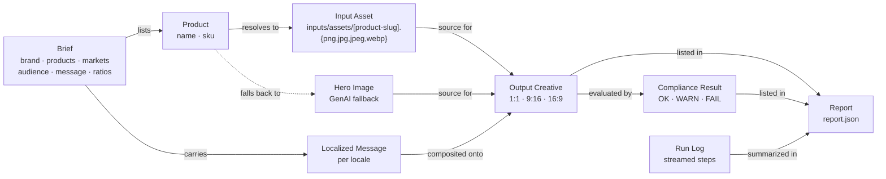
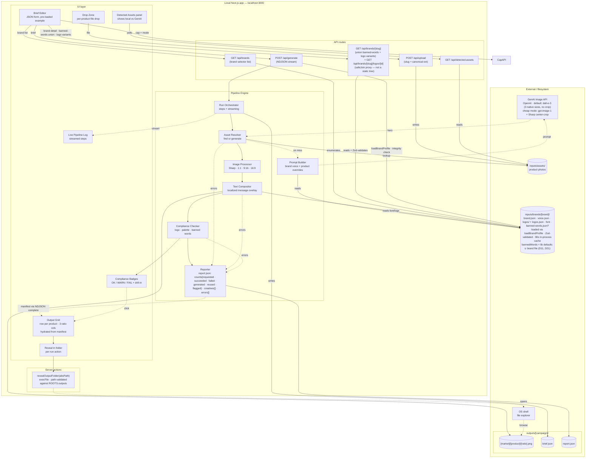
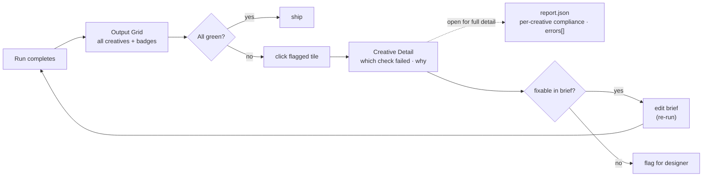

# System Map — Cast: Creative Automation Studio Toolchain

### Local Next.js App · POC · v1

> Bridges the [user stories](user-stories.md) to a buildable solution. Entities, actors, and subsystems are pulled directly from the verbs/nouns in Maya's, Priya's, and Aaron's stories.

---

## 1. Entity Map — the nouns in the system

The "things" the system stores, moves, and renders. Pulled from the user-story verbs (edit a **brief**, drop a **photo**, generate a **hero image**, render an **output**, badge for **compliance**, write a **report**).



---

## 2. Actor Map — who does what

Three actors, each with a distinct primary verb. Same system, three lenses.


---

## 3. Subsystem Map — how the parts fit together

The verbs from the stories cluster into seven subsystems. Anything inside the dashed box runs inside the local Next.js app; anything outside is filesystem or third-party.



---

## 4. Data flow — one Generate click, end to end

How a single click on **Generate** moves a brief through the system and back to the screen.

> **Concurrency model (D20).** Markets iterate sequentially in the outer loop for deterministic log order; ratios fan out via `Promise.all` per `(product, market)` pair (`par`/`and` block below).
>
> **Failure semantics.** Step-level failures (GenAI error, Sharp error, compliance exception) append to `errors[]` and the run continues — never aborts. The grid hydrates from the manifest delivered in the NDJSON `complete` event, not from a second filesystem read.
>
> **GenAI retry (D31).** Transient failures (`429`, `5xx`, `ETIMEDOUT`/`ECONNRESET`) retry with bounded exponential backoff (3 attempts: 1 s → 4 s → 16 s, ±25% jitter). `Retry-After` is honored, capped at 30 s so a stuck creative can't block the run past D30's 90 s stream-idle window. Non-transient `4xx` (content-policy, schema rejection) does not retry. On exhaustion `errors[].message` carries the upstream failure verbatim: HTTP responses use `<status> <provider error string>`; non-HTTP transport failures (e.g. `ETIMEDOUT`/`ECONNRESET`) use `OpenAI <code>: <message>`. **Provider-swap fallback is out of scope** — aspect-ratio fidelity (D9) and intra-campaign visual consistency (Story 2) outrank provider uptime in a POC; `CAST_GENAI_MODE` is the operator-time toggle, not runtime.
>
> **Run idempotency (D15).** Generate (S1) and Retry (S2′) both clear `outputs/[campaign]/` recursively at run start, then immediately rewrite `brief.json` (before the per-product loop) and `report.json` (after the loop). Validated through `safeJoin` against the `outputs` ROOT; `SLUG_RE` validates the campaign segment first.

```mermaid
sequenceDiagram
    autonumber
    actor User as Maya / Aaron
    participant UI as Brief Editor
    participant Orc as Run Orchestrator
    participant Res as Asset Resolver
    participant FS as inputs/assets
    participant AI as GenAI API
    participant Img as Resizer + Compositor
    participant Out as /outputs
    participant Chk as Compliance Checker
    participant Rep as Reporter
    participant Log as Live Log + Grid

    User->>UI: edit brief, click Generate
    UI->>Orc: POST brief
    Orc-->>Log: step "run started"
    loop for each product
        Orc->>Res: resolve hero for product
        Res->>FS: look up input asset
        alt asset found (source = local, increments reused)
            FS-->>Res: file path
        else asset missing
            Note over Res,AI: mode = dall-e-3 (default) | gpt-image-1 (cheap)<br/>D31: retry 429/5xx ×3 (1s/4s/16s ±25% jitter)<br/>Retry-After honored ≤ 30s; no provider swap
            Res->>AI: generate hero image
            alt GenAI ok (source = genai, increments generated; cap +1 once)
                AI-->>Res: image bytes
            else GenAI failure (retries exhausted or non-transient 4xx)
                AI-->>Res: error (HTTP status + provider msg preserved)
                Res-->>Rep: push to errors[] · stage: 'genai'
            end
        end
        Res-->>Orc: hero image
        Orc-->>Log: step "asset ready"
        par 1:1
            Orc->>Img: resize + composite (1:1, locale)
            Img->>Out: save creative
            Orc->>Chk: check creative
            Chk-->>Orc: OK / WARN / FAIL
            Orc-->>Log: step "creative ready + badge"
        and 9:16
            Orc->>Img: resize + composite (9:16, locale)
            Img->>Out: save creative
            Orc->>Chk: check creative
            Chk-->>Orc: OK / WARN / FAIL
            Orc-->>Log: step "creative ready + badge"
        and 16:9
            Orc->>Img: resize + composite (16:9, locale)
            Img->>Out: save creative
            Orc->>Chk: check creative
            Chk-->>Orc: OK / WARN / FAIL
            Orc-->>Log: step "creative ready + badge"
        end
    end
    Orc->>Rep: write report.json
    Rep-->>Log: complete event { manifest }
    Log-->>User: grid hydrates from manifest (no second FS read)
    opt user clicks Reveal in folder
        User->>Orc: invoke server action revealOutputFolder(absPath)
        Orc-->>Log: opens outputs/[campaign] in OS shell
    end
    alt run-level failure (uncaught throw outside per-creative tries)
        Orc-->>Log: error event
        Note over User: Failed state S2′ — Edit brief or Retry both clear the campaign output folder before re-running (D15)
    end
```

---

## 5. Compliance flow — Priya's lens

Priya never touches the pipeline; she lives on the output grid. Her flow is a read-and-drill loop on the artifacts the engine already produced.



---

## 6. Story → subsystem coverage

A sanity check that every user-story verb has a home in the system map. **Source** column declares whether a row traces to a user-story verb or a README design decision.

| Verb / capability                                                  | Subsystem that owns it                                                 | Source                                       |
| ------------------------------------------------------------------ | ---------------------------------------------------------------------- | -------------------------------------------- |
| edit campaign brief in UI                                          | Brief Editor                                                           | Story 1 (Maya)                               |
| read brand / products / markets / audience / message               | Brief Editor → Run Orchestrator                                        | Story 1                                      |
| drop product photos in UI                                          | Drop Zone → `POST /api/upload`                                         | Story 1                                      |
| see detected vs missing assets                                     | Detected Assets panel → `GET /api/detected-assets`                     | Design addition (supports Story 1 drop verb) |
| pick a brand for this campaign                                     | Brand selector → `GET /api/brands`                                     | Story 1 ("selects Brisa")                    |
| fetch brand detail (union banned-words + logo variants)            | Brand selector → `GET /api/brands/[slug]`                              | Design addition (D11, D21, D27)              |
| select logo variant for the campaign                               | Logo picker → `brief.logoVariant` (cross-validated server-side)        | Design addition (D27)                        |
| look up input assets in `inputs/assets/`                           | Asset Resolver                                                         | Story 1                                      |
| read brand profile (colors, voice, logo, font)                     | Asset Resolver / Prompt Builder / Compositor → `inputs/brands/[brand]/` | Story 1                                      |
| load + integrity-check brand profile                               | Run Orchestrator → `loadBrandProfile` (Zod via `brandProfileSchema`)    | Design addition (flow §4.3 D11)              |
| generate hero image when missing                                   | Prompt Builder → GenAI API                                             | Story 1                                      |
| GenAI mode: `dall-e-3` (default) vs `gpt-image-1` (cheap)          | Asset Resolver / Prompt Builder → GenAI API                            | Design addition (README: GenAI provider)     |
| resize to 1:1, 9:16, 16:9                                          | Image Processor (Sharp)                                                | Story 1                                      |
| composite localized message overlay                                | Text Compositor                                                        | Story 1                                      |
| stream pipeline log in real time                                   | Run Orchestrator → Live Pipeline Log                                   | Story 1 / Story 3                            |
| display output grid in browser (manifest-hydrated)                 | Output Grid ← Reporter manifest (NDJSON `complete`)                    | Story 1 + README (API style)                 |
| save outputs to `outputs/[campaign]/[market]/[product]/[ratio].png` | Image Processor → filesystem                                           | Story 1                                      |
| open output folder / grab files                                    | Reveal in folder → `revealOutputFolder` server action → OS shell      | Story 1 ("opens the output folder")          |
| check logo / colors / prohibited words                             | Compliance Checker                                                     | Story 2 (Priya)                              |
| badge each output OK / WARN / FAIL                                 | Compliance Checker → Badge UI                                          | Story 2                                      |
| drill into flagged creative for full detail                        | Creative Detail → `report.json`                                        | Story 2 ("opens the report")                 |
| write `brief.json`                                                 | Run Orchestrator                                                       | Story 1                                      |
| write `report.json` (counts, creatives[], errors[])                | Reporter                                                               | Story 1 + Story 2                            |
| aggregate step failures into `errors[]` (run never aborts)         | Run Orchestrator → Reporter                                            | Story 1 ("not blocked") + README             |
| run idempotency: clear `outputs/[campaign]/` at run start           | Run Orchestrator (Generate + Retry)                                    | Design addition (D15)                        |

---

_Cast · System Map v1 · Adobe FDE Take-Home · Aaron Davis · 2026_
