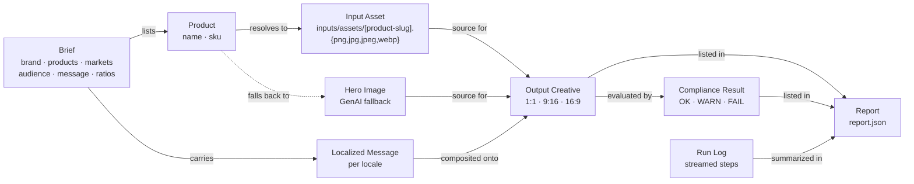
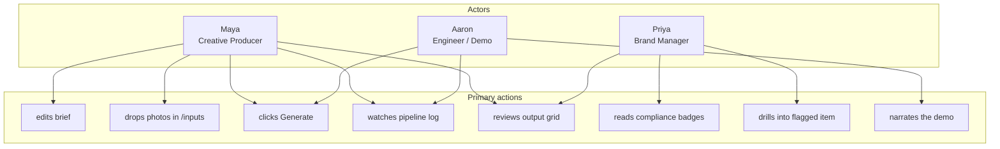
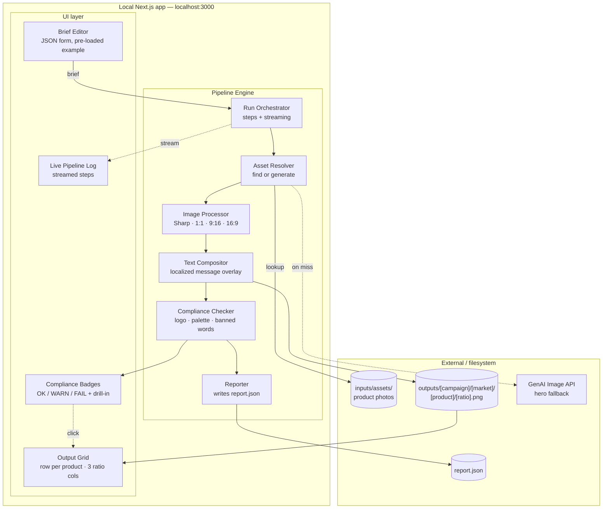
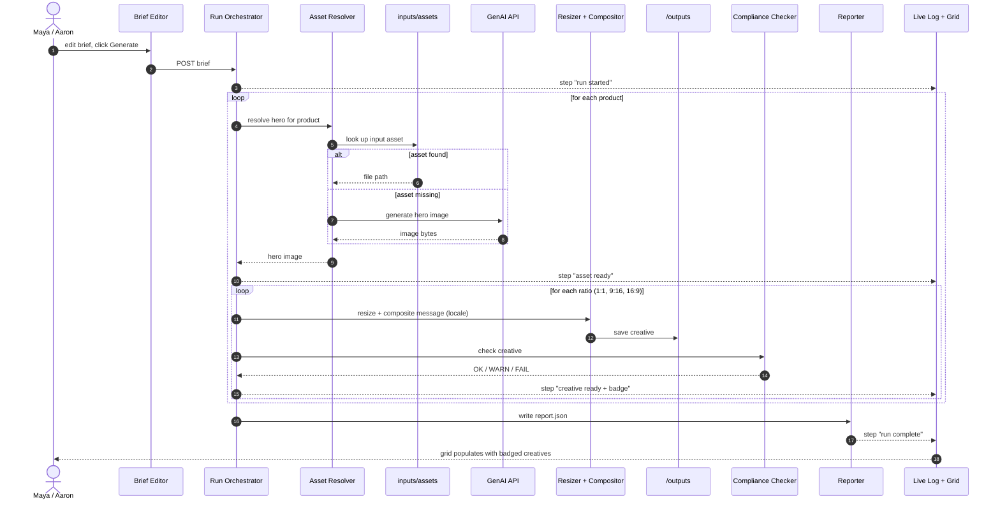
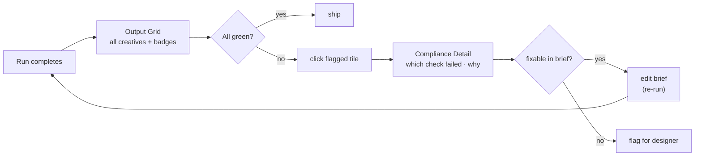

# System Map — Cast: Creative Automation Pipeline

### Local Next.js App · POC · v1

> Bridges the [user stories](user-stories.md) to a buildable solution. Entities, actors, and subsystems are pulled directly from the verbs/nouns in Maya's, Priya's, and Aaron's stories.

---

## 1. Entity Map — the nouns in the system

The "things" the system stores, moves, and renders. Pulled from the user-story verbs (edit a **brief**, drop a **photo**, generate a **hero image**, render an **output**, badge for **compliance**, write a **report**).

---

## 2. Actor Map — who does what

Three actors, each with a distinct primary verb. same system, three lenses.

---

## 3. Subsystem Map — how the parts fit together

The verbs from the stories cluster into seven subsystems. Anything inside the dashed box runs inside the local Next.js app; anything outside is filesystem or third-party.

---

## 4. Data flow — one Generate click, end to end

How a single click on **Generate** moves a brief through the system and back to the screen.

---

## 5. Compliance flow — Priya's lens

Priya never touches the pipeline; she lives on the output grid. Her flow is a read-and-drill loop on the artifacts the engine already produced.

---

## 6. Story → subsystem coverage

A sanity check that every user-story verb has a home in the system map.

| Story verb (from [user-stories.md](user-stories.md))        | Subsystem that owns it               |
| ----------------------------------------------------------- | ------------------------------------ |
| edit campaign brief in UI                                   | Brief Editor                         |
| read brand / products / markets / audience / message        | Brief Editor → Run Orchestrator      |
| look up input assets in `inputs/assets/`                    | Asset Resolver                       |
| generate hero image when missing                            | Asset Resolver → GenAI API           |
| resize to 1:1, 9:16, 16:9                                   | Image Processor (Sharp)              |
| composite localized message overlay                         | Text Compositor                      |
| stream pipeline log in real time                            | Run Orchestrator → Live Pipeline Log |
| display output grid in browser                              | Output Grid                          |
| save outputs to `outputs/[campaign]/[market]/[product]/[ratio].png` | Image Processor → filesystem |
| check logo / colors / prohibited words                      | Compliance Checker                   |
| badge each output OK / WARN / FAIL                          | Compliance Checker → Badge UI        |
| write `report.json`                                         | Reporter                             |

---

_Cast · System Map v1 · Adobe FDE Take-Home · Aaron Davis · 2026_
