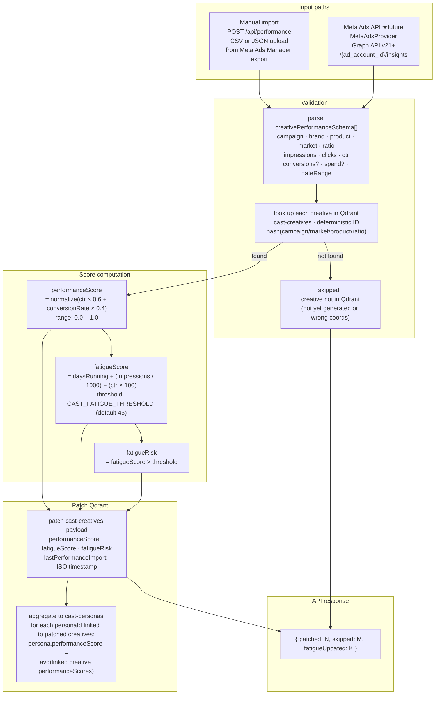
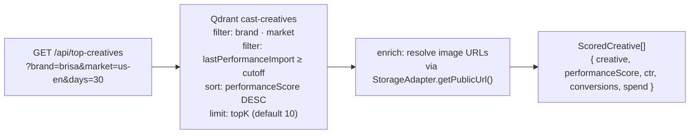
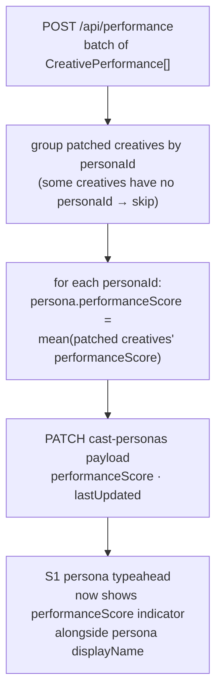
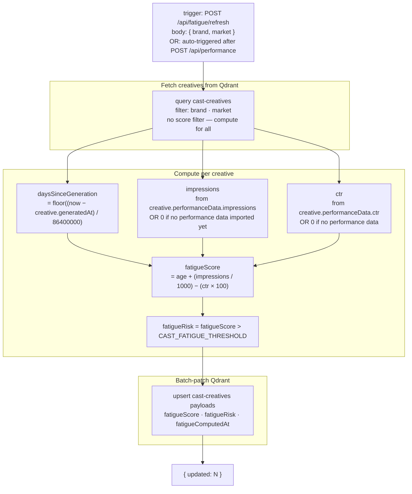
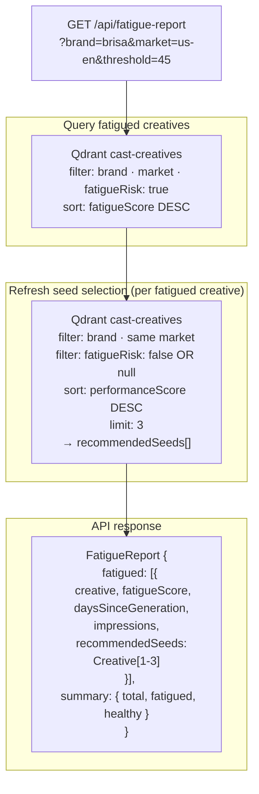
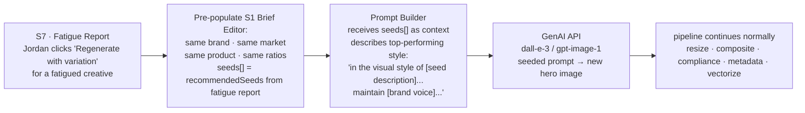
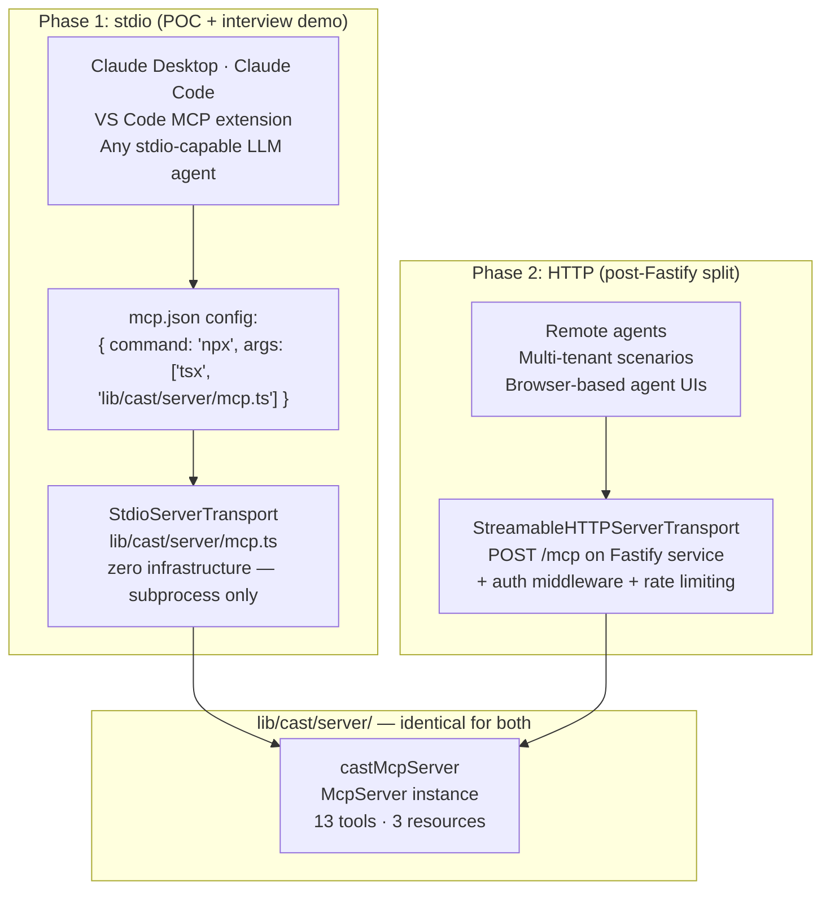
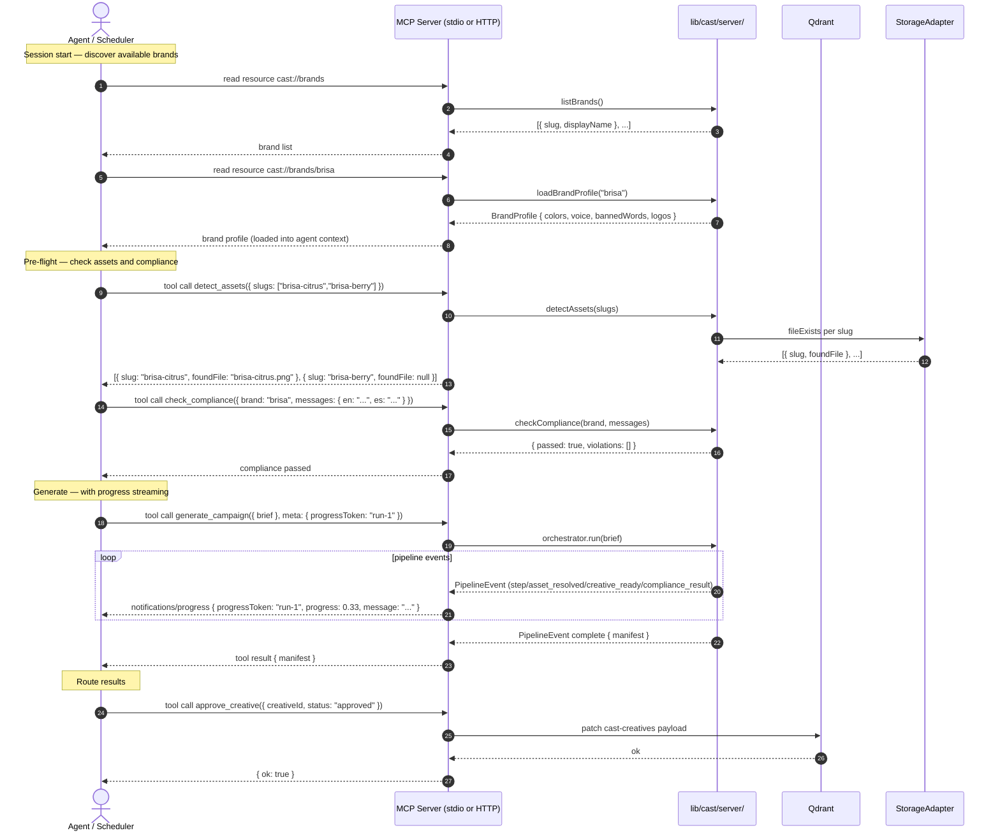
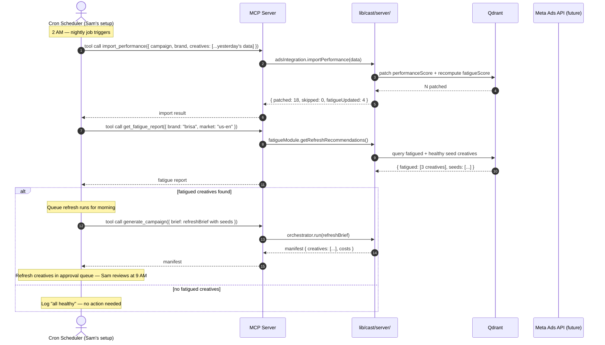
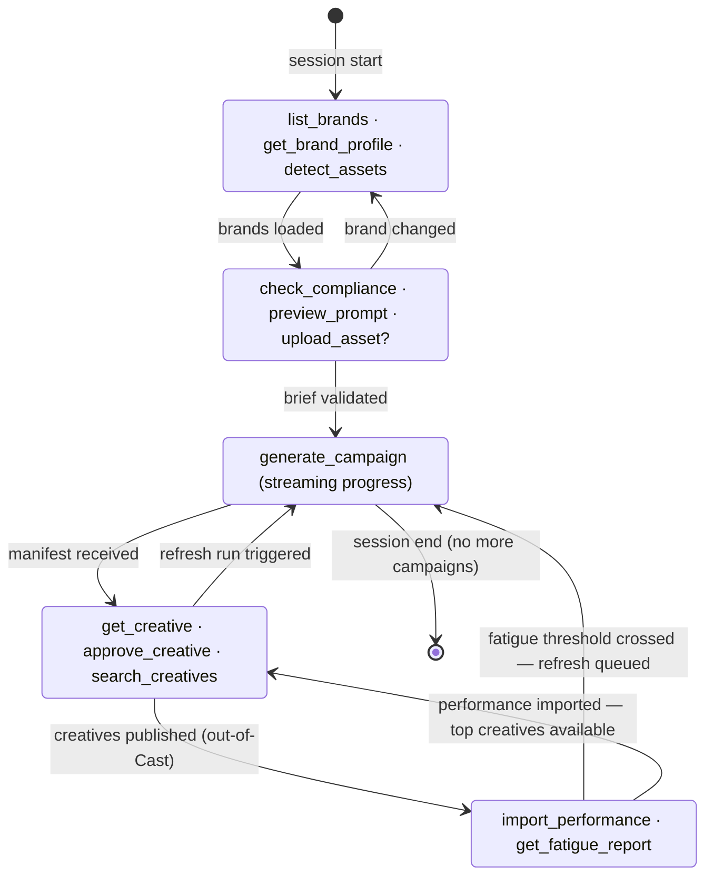

# Flow Diagrams — Cast v2 Extension

> This document adds sections §9–§11 to [flow-diagrams.md](../flow-diagrams.md). That file covers §1–§8 (screens S1–S5, API contract, brief schema, brand profile schema, future scope). This file picks up where it leaves off and covers the three new data flows introduced in v2: performance feedback, ad fatigue, and agent/MCP caller. Read flow-diagrams.md first.

---

## §9 — Performance Feedback Flow

### 9.1 What it is

Performance feedback is the mechanism by which ad platform data (CTR, conversions, spend) flows back into Cast and modifies future generation behavior. Without it, every campaign starts from zero. With it, the system learns which creatives performed, which personas converted, and which assets are aging out.

The flow has two input paths (manual CSV/JSON import today, Meta Ads API in future) and three output effects (performanceScore on creatives, performanceScore on personas, fatigueScore recomputed).

### 9.2 Performance import flow — end to end



### 9.3 Top-creatives retrieval flow

After performance data is imported, agents and humans can retrieve the leaderboard. This drives both the S6 Performance Dashboard and the `search_creatives` MCP tool with `minPerformanceScore` filter.



### 9.4 Persona performance aggregation



### 9.5 Error semantics

- Creative not in Qdrant → `skipped++`, no error thrown, run continues
- Malformed `CreativePerformance` entry → Zod validation failure → `400` before any Qdrant writes
- Qdrant unreachable → `503` with `{ error: "Qdrant unavailable" }`, no partial writes
- Partial batch: all-or-nothing per creative — a single creative's score update either fully commits or is skipped. No half-patched payloads.

---

## §10 — Ad Fatigue Flow

### 10.1 What it is

Ad fatigue occurs when a creative's audience has been overexposed — CTR declines despite continued spend. Cast detects fatigue by computing a score that combines creative age, impression volume, and CTR. Fatigued creatives are surfaced in the S7 Fatigue Report with top-performing creatives from the same brand/market recommended as generation seeds.

**Formula (canonical — single source of truth):**

```
fatigueScore = daysSinceGeneration + (impressions / 1000) − (ctr × 100)
```

- `daysSinceGeneration` — integer days since the creative's `generatedAt` timestamp
- `impressions / 1000` — normalized impression volume (1M impressions → +1000 to score)
- `ctr × 100` — performance offset (3% CTR → −3 from score)
- Higher score = more fatigued

**Threshold:** `CAST_FATIGUE_THRESHOLD` env var, default `45`. Creatives above threshold get `fatigueRisk: true` on their Qdrant payload.

All three — `cast-data-v2.jsx::computeFatigueScore()`, `lib/cast/server/fatigue.ts::computeFatigueScore()`, and this formula — must stay in sync. The TypeScript implementation is the source; the JSX fixture and this doc reference it.

### 10.2 Fatigue score computation flow



**Note on creatives with no performance data:** `fatigueScore = daysSinceGeneration + 0 − 0 = daysSinceGeneration`. A creative with no performance data that is 50 days old will score 50 — above the default threshold. This is intentional: stale untracked creatives should be flagged for review.

### 10.3 Fatigue report and refresh recommendation flow



### 10.4 Seeded refresh run flow

When Jordan or an agent triggers a refresh from the Fatigue Report (S7), the next generation run uses top-performing creatives as style references in the prompt builder.



### 10.5 Fatigue detection — edge cases

| Scenario | Behavior |
| --- | --- |
| No performance data imported yet | `fatigueScore = daysSinceGeneration`, `impressions = 0`, `ctr = 0`. Score is age-only. Old untracked creatives still get flagged. |
| Creative younger than threshold | `fatigueScore < 45` → `fatigueRisk: false`. Not included in report. |
| Qdrant unavailable | `GET /api/fatigue-report` returns `503`. `POST /api/fatigue/refresh` returns `503`. Neither crashes the generation pipeline. |
| No creatives for brand/market | Returns `{ fatigued: [], summary: { total: 0, fatigued: 0, healthy: 0 } }`. |
| No healthy seeds for a fatigued creative | `recommendedSeeds: []`. Agent/human must construct seeds manually. |

---

## §11 — Agent / MCP Caller Flow

### 11.1 Transport selection



### 11.2 Typical agent session — discovery + generation

The agent reads brand context from resources, pre-screens the brief, then generates.



### 11.3 Scheduled agent session — nightly fatigue check

Sam's automation: runs nightly, imports yesterday's Meta export, flags fatigued creatives, queues refresh runs for morning review.



### 11.4 Tool annotation reference

| Tool | `readOnlyHint` | `destructiveHint` | Notes |
| --- | --- | --- | --- |
| `list_brands` | ✓ | — | Safe to call speculatively |
| `get_brand_profile` | ✓ | — | Safe to call speculatively |
| `detect_assets` | ✓ | — | Safe to call speculatively |
| `preview_prompt` | ✓ | — | Safe to call speculatively |
| `check_compliance` | ✓ | — | Safe to call speculatively |
| `upload_asset` | — | — | Creates data; idempotent (overwrite) |
| `generate_campaign` | — | — | Creates output files; costs money |
| `get_manifest` | ✓ | — | Safe to call speculatively |
| `get_creative` | ✓ | — | Safe to call speculatively |
| `search_creatives` | ✓ | — | Qdrant-dependent; degrades gracefully |
| `approve_creative` | — | ✓ | Modifies persistent approval state |
| `get_fatigue_report` | ✓ | — | Qdrant-dependent; degrades gracefully |
| `import_performance` | — | — | Modifies Qdrant; idempotent per creative |

`readOnlyHint: true` — agent may call without user confirmation. `destructiveHint: true` — agent should confirm with user before calling, especially in batch operations. Tools with neither annotation create or transform data but are reversible (a re-run overwrites; an import can be re-imported with corrected data).

### 11.5 Graceful degradation when Qdrant is unavailable

The 4 Qdrant-dependent tools (`search_creatives`, `approve_creative`, `get_fatigue_report`, `import_performance`) check `isQdrantEnabled()` on each call:

```
isQdrantEnabled() === false
  → tool returns: { error: "Qdrant not configured — set QDRANT_URL and QDRANT_API_KEY", degraded: true }
  → MCP server does NOT crash
  → tools 1–9 continue to work normally
  → generate_campaign still runs the full pipeline (metadata analysis skipped, no vectorization)
```

An agent receiving `{ degraded: true }` should surface this to the human rather than silently failing. Suggested agent behavior: "Cast is running in degraded mode — semantic search and approval persistence are unavailable. Set QDRANT_URL to enable these features."

### 11.6 State machine — agent session states


