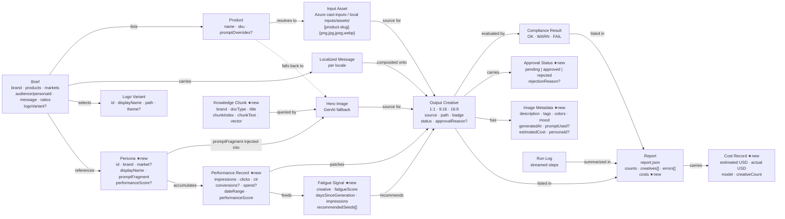
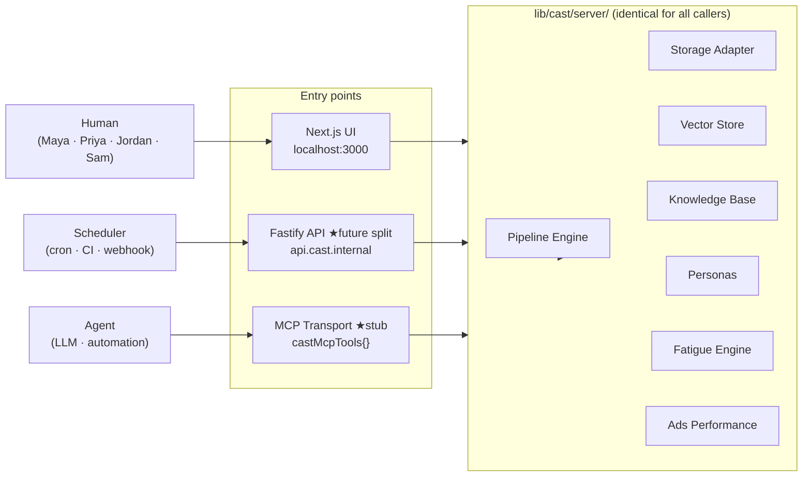
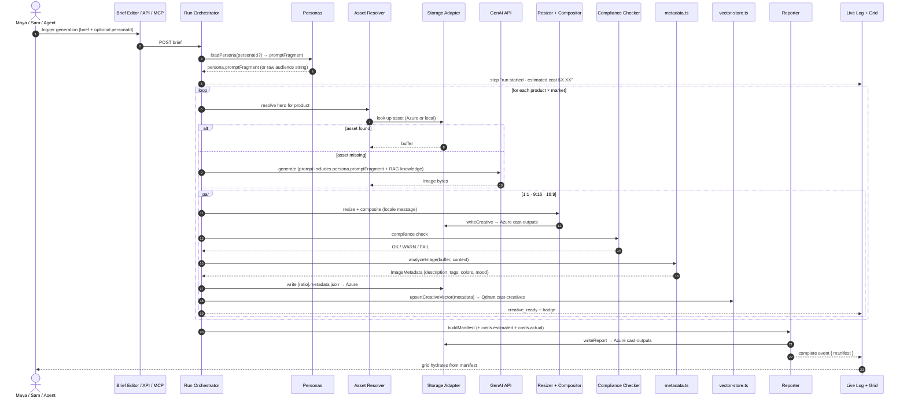
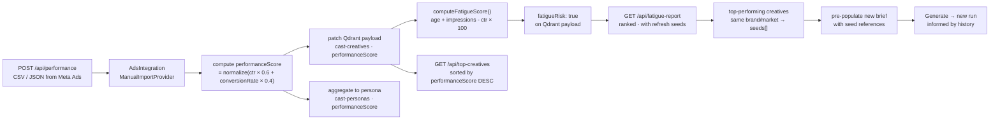
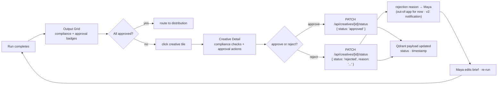
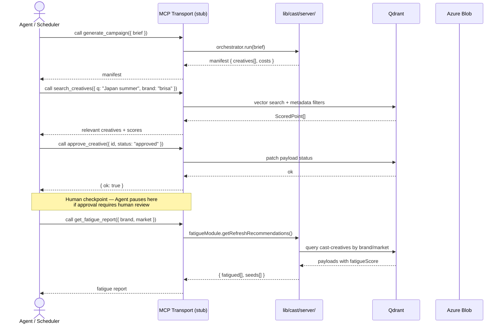

# System Map — Cast: Creative Automation Studio Toolchain (v2)

> v2 extends the original system map with five new personas (Jordan, Sam), eight new entities (Persona, PerformanceRecord, FatigueSignal, ApprovalStatus, ImageMetadata, KnowledgeChunk, CostRecord, MCPTool), a restructured subsystem map reflecting Azure Blob + Qdrant + the AdsPerformanceProvider interface, and two new data flows (performance feedback loop, agent/MCP caller). Original content is preserved and extended, not replaced.

---

## 1. Entity Map — the nouns in the system

The "things" the system stores, moves, and renders.



---

## 2. Actor Map — who does what

Five actors across the full system lifecycle.

```mermaid
graph TB
    subgraph Actors
        Maya["Maya<br/>Creative Producer"]
        Priya["Priya<br/>Brand Manager"]
        Aaron["Aaron<br/>Engineer / Demo"]
        Jordan["Jordan ★new<br/>Growth Marketer<br/>/ Perf Analyst"]
        Sam["Sam ★new<br/>Marketing Ops<br/>/ Scheduler"]
        Agent["Agent ★new<br/>Automated caller<br/>(scheduler · CI · LLM)"]
    end

    subgraph Verbs["Primary actions"]
        Edit["edits brief"]
        SelectPersona["selects persona ★new"]
        Drop["drops photos"]
        Generate["triggers generation"]
        Watch["watches pipeline log"]
        Review["reviews output grid"]
        Approve["approves / rejects ★new"]
        Read["reads compliance badges"]
        Drill["drills into flagged item"]
        Import["imports performance data ★new"]
        ViewPerf["views top-performing ★new"]
        ViewFatigue["reads fatigue report ★new"]
        TriggerRefresh["triggers seeded refresh ★new"]
        Schedule["schedules recurring run ★new"]
        Demo["narrates the demo"]
        CallAPI["calls Cast via API/MCP ★new"]
    end

    Maya --> Edit
    Maya --> SelectPersona
    Maya --> Drop
    Maya --> Generate
    Maya --> Watch
    Maya --> Review

    Priya --> Review
    Priya --> Read
    Priya --> Drill
    Priya --> Approve

    Aaron --> Generate
    Aaron --> Watch
    Aaron --> Demo

    Jordan --> Import
    Jordan --> ViewPerf
    Jordan --> ViewFatigue
    Jordan --> TriggerRefresh

    Sam --> Schedule
    Sam --> CallAPI
    Sam --> Review

    Agent --> CallAPI
    Agent --> Generate
    Agent --> Approve
```



---

## 3. Subsystem Map — how the parts fit together

```mermaid
graph TB
    subgraph External["External services"]
        subgraph AzureBlob["Azure Blob Storage"]
            AzInputs[("cast-inputs<br/>product photos")]
            AzOutputs[("cast-outputs<br/>generated PNGs + metadata JSONs")]
            AzBrands[("cast-brands<br/>brand.json · voice.json · logos · font")]
        end
        subgraph QdrantCloud["Qdrant Cloud"]
            QCreatives[("cast-creatives<br/>image metadata vectors<br/>performanceScore · fatigueScore<br/>status · personaId")]
            QKnowledge[("cast-knowledge<br/>brand guidelines chunks<br/>country rules chunks")]
            QPersonas[("cast-personas<br/>persona vectors<br/>promptFragment · performanceScore")]
        end
        GenAI["GenAI Image API<br/>OpenAI · dall-e-3 / gpt-image-1"]
        MetaAds["Meta Ads API ★stub<br/>AdsPerformanceProvider IF<br/>ManualImportProvider (live)<br/>MetaAdsProvider (TODO)"]
        OS["OS shell · file explorer"]
    end

    subgraph App["Next.js 16 monorepo — localhost:3000"]
        direction TB

        subgraph UI["UI layer"]
            Editor["Brief Editor<br/>form + JSON toggle<br/>persona typeahead ★new<br/>cost estimate ★new"]
            DropZone["Drop Zone<br/>per-product"]
            DetectedPanel["Detected Assets panel"]
            LogView["Live Pipeline Log"]
            Grid["Output Grid<br/>approval badges ★new<br/>fatigue badges ★new"]
            BadgeUI["Compliance + Approval Badges ★new"]
            PerfDash["Performance Dashboard S6 ★new<br/>top creatives · cost tracking"]
            FatigueDash["Fatigue Report S7 ★new<br/>ranked fatigue · refresh seeds"]
        end

        subgraph API["API routes (thin pass-throughs)"]
            UploadAPI["POST /api/upload"]
            DetectedAPI["GET /api/detected-assets"]
            GenerateAPI["POST /api/generate (NDJSON)"]
            BrandsAPI["GET /api/brands"]
            BrandDetailAPI["GET /api/brands/[slug]"]
            PersonasAPI["GET|POST /api/personas ★new"]
            SearchAPI["GET /api/search-creatives ★new"]
            KnowledgeAPI["GET /api/knowledge ★new"]
            PerfAPI["POST /api/performance ★new"]
            StatusAPI["PATCH /api/creatives/[id]/status ★new"]
            TopAPI["GET /api/top-creatives ★new"]
            FatigueAPI["GET /api/fatigue-report ★new<br/>POST /api/fatigue/refresh ★new"]
            IngestAPI["POST /api/ingest ★new (dev only)"]
        end

        subgraph Actions["Server actions"]
            RevealAction["revealOutputFolder"]
            CopyPathAction["resolveCreativeAbsolutePath"]
        end

        subgraph Server["lib/cast/server/ (future Fastify service body)"]
            subgraph Storage["storage.ts"]
                StorageIF["StorageAdapter interface"]
                LocalFS["LocalFsAdapter"]
                AzureAdapter["AzureBlobAdapter ★new"]
            end
            BrandLoader["brand-loader.ts<br/>Zod-validated · 90s cache"]
            Config["config.ts ★new<br/>isAzureEnabled() · isQdrantEnabled()"]
            subgraph Pipeline["pipeline/"]
                Orchestrator["orchestrator.ts"]
                Resolver["asset-resolver.ts"]
                PromptBuilder["prompt-builder.ts<br/>+ persona.promptFragment ★new<br/>+ RAG knowledge context ★new"]
                Resizer["image-processor.ts (Sharp)"]
                Compositor["text-compositor.ts"]
                Checker["compliance-checker.ts"]
                Reporter["reporter.ts<br/>+ costs field ★new"]
            end
            MetadataModule["metadata.ts ★new<br/>analyzeImage() → ImageMetadata<br/>gpt-4o-mini · fallback-safe"]
            VectorStore["vector-store.ts ★new<br/>getQdrantClient()<br/>upsertCreativeVector()<br/>searchCreatives()"]
            KnowledgeBase["knowledge-base.ts ★new<br/>ingestMarkdown()<br/>queryKnowledge()"]
            PersonasModule["personas.ts ★new<br/>upsertPersona()<br/>listPersonas()<br/>promoteFromFreeText()"]
            FatigueModule["fatigue.ts ★new<br/>computeFatigueScore()<br/>getRefreshRecommendations()"]
            AdsIntegration["integrations/ads-performance.ts ★new<br/>AdsPerformanceProvider IF<br/>ManualImportProvider<br/>MetaAdsProvider (stub)"]
            MCPStub["mcp.ts ★new<br/>castMcpTools{}<br/>generate_campaign · search_creatives<br/>approve_creative · get_fatigue_report<br/>import_performance"]
            ServerBarrel["index.ts ★new<br/>barrel export<br/>'Everything exported here<br/>becomes the Fastify service API'"]
        end
    end

    Editor -->|brief| GenerateAPI
    Editor -->|persona query| PersonasAPI
    Editor -->|brand list| BrandsAPI
    Editor -->|brand detail| BrandDetailAPI
    Grid -->|approve/reject| StatusAPI
    PerfDash -->|top creatives| TopAPI
    FatigueDash -->|fatigue data| FatigueAPI

    GenerateAPI --> Orchestrator
    PersonasAPI --> PersonasModule
    SearchAPI --> VectorStore
    KnowledgeAPI --> KnowledgeBase
    PerfAPI --> AdsIntegration
    PerfAPI --> FatigueModule
    StatusAPI --> VectorStore
    TopAPI --> VectorStore
    FatigueAPI --> FatigueModule
    IngestAPI --> MetadataModule
    IngestAPI --> VectorStore

    Orchestrator --> Resolver
    Orchestrator --> BrandLoader
    Orchestrator --> Reporter
    Resolver --> StorageIF
    Resolver -.->|on miss| PromptBuilder
    PromptBuilder --> BrandLoader
    PromptBuilder -.->|RAG| KnowledgeBase
    PromptBuilder -.->|persona fragment| PersonasModule
    PromptBuilder -.->|prompt| GenAI
    GenAI -.->|hero bytes| Resolver
    Resolver --> Resizer
    Resizer --> Compositor
    Compositor --> StorageIF
    Compositor --> Checker
    Checker --> Reporter
    Reporter --> StorageIF

    StorageIF --> LocalFS
    StorageIF --> AzureAdapter
    LocalFS -.->|local dev| AzInputs
    AzureAdapter -->|prod| AzInputs
    AzureAdapter -->|prod| AzOutputs
    AzureAdapter -->|prod| AzBrands
    BrandLoader --> StorageIF

    MetadataModule -.->|after writeCreative| VectorStore
    MetadataModule -.->|after writeCreative| StorageIF
    VectorStore --> QCreatives
    KnowledgeBase --> QKnowledge
    PersonasModule --> QPersonas
    AdsIntegration -.->|patch performanceScore| QCreatives
    AdsIntegration -.->|Meta API (stub)| MetaAds
    FatigueModule --> QCreatives
    FatigueModule --> QPersonas

    MCPStub -.->|wraps| ServerBarrel
    ServerBarrel --> Orchestrator
    ServerBarrel --> VectorStore
    ServerBarrel --> FatigueModule
    ServerBarrel --> AdsIntegration
    ServerBarrel --> PersonasModule
```

---

## 4. Three callers, one server layer

This is the architectural thesis of v2. The same `lib/cast/server/` code serves all three entry points. The UI is one caller, not the only one.



**The Fastify split is mechanical, not architectural.** When the split is needed, `lib/cast/server/` moves to a new repo, Fastify route wrappers are added, and `app/api/*` fetch calls are repointed to `NEXT_PUBLIC_API_URL`. The `index.ts` barrel export is the future service contract — every function exported there becomes a Fastify route.

---

## 5. Data flow — one Generate click, end to end (v2)

> v2 additions: persona fragment injected into prompt, metadata pipeline runs post-write, creative vectorized into Qdrant, cost tracked in manifest.



---

## 6. Performance feedback flow — Jordan's lens

Jordan never touches the generation pipeline. He works on the output of past runs, closing the loop so future generations start from what worked.



---

## 7. Approval flow — Priya's lens (v2)



---

## 8. Agent / MCP caller flow — Sam's lens



---

## 9. Story → subsystem coverage (v2 complete)

| Verb / capability | Subsystem that owns it | Source |
| --- | --- | --- |
| edit campaign brief in UI | Brief Editor | Story 1 (Maya) |
| select buyer persona from typeahead | Brief Editor → `GET /api/personas` → `personas.ts` | Story 1 v2 / Story 4 |
| see cost estimate before Generate | Brief Editor → cost calc (products × markets × ratios × model cost) | Story 1 v2 |
| drop product photos in UI | Drop Zone → `POST /api/upload` → StorageAdapter | Story 1 |
| see detected vs missing assets | Detected Assets panel → `GET /api/detected-assets` | Design addition |
| pick a brand for this campaign | Brand selector → `GET /api/brands` | Story 1 |
| select logo variant | Logo picker → `brief.logoVariant` | Design addition |
| look up input assets | Asset Resolver → StorageAdapter (Azure or local) | Story 1 |
| read brand profile | `loadBrandProfile` → StorageAdapter → Zod | Story 1 |
| query knowledge base for prompt context | PromptBuilder → `knowledge-base.ts` → Qdrant | Design addition (RAG) |
| inject persona.promptFragment into prompt | PromptBuilder → `personas.ts` | Story 1 v2 |
| generate hero image when missing | PromptBuilder → GenAI API | Story 1 |
| resize to 1:1, 9:16, 16:9 | Image Processor (Sharp) | Story 1 |
| composite localized message overlay | Text Compositor | Story 1 |
| stream pipeline log in real time | Run Orchestrator → Live Pipeline Log | Story 1 / Story 3 |
| analyze image and generate metadata | `metadata.ts` → gpt-4o-mini → ImageMetadata | Design addition |
| vectorize creative into Qdrant | `vector-store.ts` → cast-creatives | Design addition |
| store image + metadata to cloud | StorageAdapter → Azure cast-outputs | Design addition |
| display output grid (manifest-hydrated) | Output Grid ← Reporter manifest | Story 1 |
| badge each output OK / WARN / FAIL | Compliance Checker → Badge UI | Story 2 |
| drill into flagged creative | Creative Detail → compliance detail | Story 2 |
| approve / reject creative | `PATCH /api/creatives/[id]/status` → Qdrant payload | Story 2 v2 |
| import performance data | `POST /api/performance` → AdsIntegration → Qdrant patch | Story 4 (Jordan) |
| view top-performing creatives | `GET /api/top-creatives` → Qdrant sorted by performanceScore | Story 4 |
| compute fatigue scores | `fatigue.ts` → Qdrant query + patch | Story 4 |
| get refresh recommendations | `GET /api/fatigue-report` → seeds from top-performers | Story 4 |
| aggregate persona performance | `personas.ts` → patch cast-personas from creative perf data | Story 4 |
| trigger generation via API (no UI) | Fastify API / Next.js routes → `lib/cast/server/` | Story 5 (Sam) |
| call Cast via MCP | `mcp.ts` castMcpTools → `lib/cast/server/` | Story 5 / Agent |
| semantic search over creative history | `GET /api/search-creatives` → Qdrant vector search | Story 5 / Story 4 |
| ingest knowledge docs to Qdrant | `POST /api/ingest` → `knowledge-base.ts` | Design addition |
| ingest historical assets | `POST /api/ingest` → `ingest.ts` → metadata → Qdrant | Design addition |
| track cost per run | Reporter → `costs { estimated, actual }` in manifest | Design addition |
| write brief.json | Run Orchestrator → StorageAdapter | Story 1 |
| write report.json | Reporter → StorageAdapter | Story 1 + Story 2 |
| open output folder | `revealOutputFolder` server action → OS shell | Story 1 |
| copy creative absolute path | `resolveCreativeAbsolutePath` server action | Design addition |
| export to Dropbox | Dropbox Saver SDK (client-side) | Design addition |
